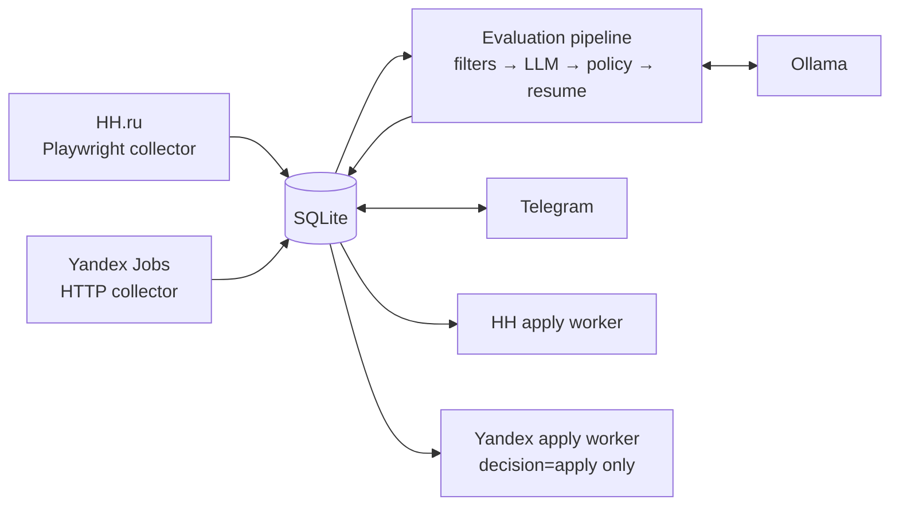
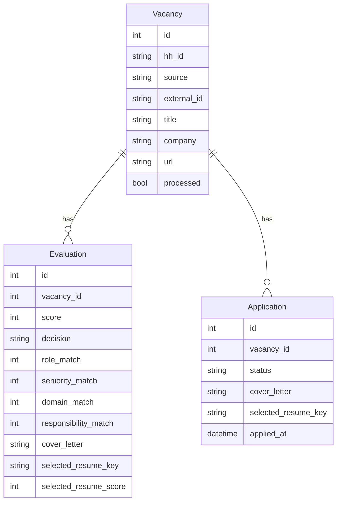
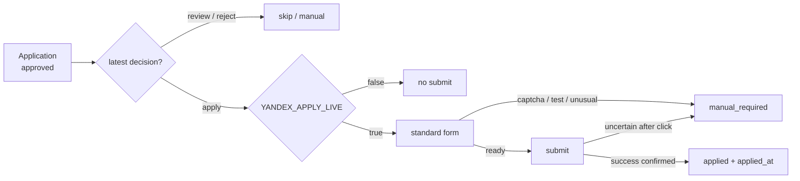

<div align="center">

# HH AGENT

**Автономный агент поиска, оценки и отклика на вакансии**  
Windows · Python · Playwright · SQLite · Ollama · Telegram

[rudenko.one](https://rudenko.one/) · `main @ 4c5dca6`

</div>

---

## 01 / Что это

HH Agent автоматизирует полный цикл работы с вакансиями:

- собирает вакансии с **HH.ru** и корпоративных career-сайтов;
- хранит их локально в **SQLite**;
- применяет hard filters до LLM;
- оценивает fit локальной моделью через **Ollama**;
- детерминированно корректирует management-кейсы;
- выбирает подходящее резюме;
- формирует vacancy-aware сопроводительное;
- показывает результаты и runtime через **Telegram**;
- выполняет отклики на **HH** и **Yandex** по разным safety-политикам.

> [!IMPORTANT]
> Yandex scheduled auto-apply отправляет только вакансии, у которых **latest Evaluation = `apply`**. `review` и `reject` автоматически не отправляются.

---

## 02 / Архитектура



Основная цепочка:

```text
hh_collect.py
    ↓
collect_careers.py
    ↓
process_vacancies.py
    ↓
apply_dispatcher.py   # scheduled Yandex only
```

Ключевой принцип: **collectors, evaluation и site adapters разделены**. UI конкретного сайта не должен определять scoring, policy или содержание сопроводительного.

---

## 03 / Модель данных



### Vacancy

Сырой объект вакансии. Новая идентичность — `source + external_id`; `hh_id` сохранён как legacy unique key.

### Evaluation

История оценки вакансии: score, decision, 4 измерения fit, gaps/red_flags, recommendation, cover letter и выбранное резюме.

### Application

Жизненный цикл отклика: статус, фактически отправляемое сопроводительное и выбранное резюме.

---

## 04 / Evaluation pipeline

Порядок обработки фиксирован:

1. **Hard filters** — быстрые однозначные запреты до LLM.
2. **VacancyEvaluator** — structured response от Ollama.
3. **Evidence guard** — убирает ложные заявления вида «нет Agile/PMO/budget/people management», если профиль это подтверждает.
4. **Management policy** — детерминированная корректировка PM/Product management cases.
5. **Resume matcher** — выбирает одно из существующих резюме.
6. **Persistence** — сохраняется Evaluation; для Yandex создаётся Application для дальнейшего dispatch.

Итоговый score считается Python-кодом:

```text
score =
    role_match           * 0.35 +
    seniority_match      * 0.20 +
    domain_match         * 0.15 +
    responsibility_match * 0.30
```

Пороги по умолчанию:

| Параметр | Default |
|---|---:|
| `SCORE_THRESHOLD` | 80 |
| `HH_REVIEW_THRESHOLD` | 70 |
| LLM temperature | 0.2 |
| `LLM_MODEL` | `gemma3:12b-it-qat` |
| `LLM_BASE_URL` | `http://localhost:11434` |

---

## 05 / Резюме и сопроводительное

Выбор резюме и генерация письма выполняются **до adapter layer**.

- HH и Yandex получают один и тот же `Application.cover_letter`;
- письмо строится только из подтверждённых фактов профиля;
- 2–3 наиболее релевантных факта связываются с задачами конкретной вакансии;
- запрещены placeholders и third-person формулировки;
- Python нормализует подпись;
- Yandex перед каждым откликом **повторно загружает выбранный локальный PDF**;
- презентация для Yandex не используется — в форме нет отдельного поля для неё.

---

## 06 / Apply architecture

### HH

Отдельный Scheduler job:

```text
HH Agent - Apply
    ↓
background_apply.py
    ↓
apply_worker.py
```

Работает только с HH Applications.

### Yandex

Yandex auto-apply встроен в основной pipeline:

```text
background_pipeline.py
    ↓
apply_dispatcher.py
    ↓
yandex_apply_worker.py
```

Pipeline передаёт:

```text
APPLY_DISPATCH_HH=false
YANDEX_APPLY_LIVE=true
YANDEX_APPLY_HEADLESS=true
```

Dispatcher дополнительно проверяет latest Evaluation.



> [!WARNING]
> Если submit был нажат, но success не подтверждён, worker переводит Application в `manual_required`. Автоматический повторный submit запрещён.

---

## 07 / Статусы Application

| Status | Значение |
|---|---|
| `notified` | вакансия показана через Telegram |
| `approved` | разрешён отклик; для Yandex отдельно требуется latest `decision=apply` |
| `applying` | worker начал обработку |
| `applied` | success подтверждён, `applied_at` заполнен |
| `manual_required` | автоматика остановилась безопасно |
| `apply_error` | техническая ошибка |
| `skipped` | отклик отклонён пользователем/логикой |
| `company_blacklist` | компания отмечена для blacklist workflow |

---

## 08 / Windows Scheduler

Текущая production-схема на Windows:

| Task | Период | Entry point |
|---|---|---|
| `HH Agent - Pipeline` | каждые 30 минут, start `00:03` | `background_pipeline.py` |
| `HH Agent - Apply` | каждые 10 минут, start `00:08` | `background_apply.py` |
| `HH Agent - Resume Raise` | каждые 30 минут, install start `00:23` | `background_resume_raise.py` |
| `HH Agent - Telegram` | at logon + restart on failure | `run_telegram.ps1` |

Pipeline состоит из 4 этапов:

```text
1 / hh_collect.py
2 / collect_careers.py
3 / process_vacancies.py
4 / apply_dispatcher.py   # Yandex only / live / headless
```

`Pipeline`, `Apply` и `Resume Raise` используют общий **AgentLock**. Если другой background job уже работает, новый запуск корректно получает `skipped`, а не стартует вторую браузерную сессию.

### Проверка Scheduler

```powershell
Get-ScheduledTask | Where-Object {$_.TaskName -like "*HH*"} |
    Select-Object TaskName, State

(Get-ScheduledTask -TaskName "HH Agent - Pipeline").Actions
(Get-ScheduledTask -TaskName "HH Agent - Apply").Actions

Get-ScheduledTaskInfo -TaskName "HH Agent - Pipeline"
```

> [!NOTE]
> На текущем хосте также замечена отдельная задача `HH Telegram Bot` в состоянии Running. Она выглядит как legacy/duplicate; перед удалением нужно проверить её Action/Trigger.

---

## 09 / Установка Scheduler

```powershell
powershell -ExecutionPolicy Bypass -File C:\hh-agent\install_tasks.ps1
powershell -ExecutionPolicy Bypass -File C:\hh-agent\install_resume_raise_task.ps1
powershell -ExecutionPolicy Bypass -File C:\hh-agent\reinstall_telegram_task.ps1
```

---

## 10 / Сессии браузера

| Source | Persistent profile |
|---|---|
| HH | `C:\hh-agent\browser-profile` |
| Yandex | `C:\hh-agent\yandex-browser-profile` |

Проверка:

```powershell
cd C:\hh-agent
.\.venv\Scripts\python.exe .\check_hh_session.py
.\.venv\Scripts\python.exe .\check_yandex_session.py
```

Повторная авторизация:

```powershell
.\.venv\Scripts\python.exe .\hh_login.py
.\.venv\Scripts\python.exe .\yandex_login.py
```

---

## 11 / Runtime и логи

Runtime state хранится в `data/runtime/`:

```text
pipeline.json
apply.json
resume_raise.json
telegram.json
```

Основные логи:

```text
logs/pipeline_supervisor.log
logs/collector.log
logs/careers_collector.log
logs/processor.log
logs/apply_dispatcher.log
logs/apply_supervisor.log
logs/apply_worker_runtime.log
logs/yandex_apply_worker.log
logs/yandex_apply_worker_attention.log
logs/resume_raise_supervisor.log
logs/resume_raise_worker.log
```

Supervisor запускает child process с UTF-8 output, hard timeout и при зависании убивает весь process tree.

```powershell
Get-Content C:\hh-agent\logs\pipeline_supervisor.log -Tail 100
Get-Content C:\hh-agent\logs\apply_dispatcher.log -Tail 150
Get-Content C:\hh-agent\data\runtime\pipeline.json
```

---

## 12 / Telegram

Команды:

| Command | Что делает |
|---|---|
| `/health` | healthcheck проекта, Ollama, runtime и очереди |
| `/status` | текущие background states |
| `/run` | запускает pipeline сейчас |
| `/new` | присылает новые вакансии |
| `/stats` | статистика Application status |

Inline actions:

- approve → `approved`;
- skip → `skipped`;
- blacklist company → `company_blacklist`.

> [!CAUTION]
> Текущий Telegram bot работает в **public mode**: команды принимаются из любого Telegram chat. Это отдельный security backlog item, если бот доступен извне.

---

## 13 / Environment

Ключевые переменные:

```text
LLM_PROVIDER=ollama
LLM_MODEL=gemma3:12b-it-qat
LLM_BASE_URL=http://localhost:11434
LLM_TIMEOUT=120
LLM_MAX_RETRIES=2

SCORE_THRESHOLD=80
HH_REVIEW_THRESHOLD=70

HH_COLLECT_HEADLESS=true
HH_APPLY_HEADLESS=true
HH_APPLY_MAX_PER_RUN=...

YANDEX_APPLY_HEADLESS=true
YANDEX_APPLY_MAX_PER_RUN=5
YANDEX_APPLY_DELAY_SECONDS=3
YANDEX_APPLY_LIVE=false
YANDEX_APPLY_APPLICATION_ID=
APPLY_DISPATCH_HH=true

TELEGRAM_BOT_TOKEN=...
TELEGRAM_CHAT_ID=...
TELEGRAM_MIN_SCORE=72
```

Не коммитить реальные токены, credentials и содержимое browser profiles.

---

## 14 / Ручной запуск

### PowerShell

```powershell
cd C:\hh-agent
.\.venv\Scripts\python.exe .\background_pipeline.py
```

### Git Bash

```bash
cd /c/hh-agent
./.venv/Scripts/python.exe ./background_pipeline.py
```

### Точечный Yandex live-run

Использовать только после проверки конкретной Application:

```bash
YANDEX_APPLY_LIVE=true \
YANDEX_APPLY_APPLICATION_ID=212 \
./.venv/Scripts/python.exe ./apply_dispatcher.py
```

---

## 15 / Диагностика Yandex Application

Безопасная последовательность:

```bash
./.venv/Scripts/python.exe ./inspect_application.py 212
./.venv/Scripts/python.exe ./inspect_yandex_apply_log.py 212
./.venv/Scripts/python.exe ./probe_yandex_application_state.py 212
```

Если probe подтверждает, что отклик **не отправлен** и обычная кнопка apply доступна:

```bash
./.venv/Scripts/python.exe ./requeue_yandex_application.py 212
```

После этого — только точечный live-run.

---

## 16 / Структура репозитория

```text
app/
  db.py                    # SQLAlchemy / SQLite / migrations
  evaluator.py             # LLM evaluation
  evaluation_policy.py     # deterministic management policy
  hard_filters.py
  role_filter.py
  resume_matcher.py
  application_assets.py

sources/
  base.py
  yandex.py                # HTTP career collector

hh_collect.py              # HH collector
collect_careers.py         # corporate source orchestrator
process_vacancies.py       # evaluation pipeline

apply_worker.py            # HH apply
apply_dispatcher.py        # source-aware routing / Yandex guard
yandex_apply_worker.py     # production Yandex submit

background_common.py       # lock / runtime / logging / child timeout
background_pipeline.py
background_apply.py
background_resume_raise.py

telegram_bot.py

inspect_*.py               # diagnostics
probe_*.py
requeue_yandex_application.py
```

---

## 17 / Safety invariants

Эти правила нельзя ломать рефакторингом:

1. **Source separation** — HH worker не получает Yandex Applications.
2. **Yandex auto = `apply` only** — `approved` недостаточно.
3. **No blind retry** — uncertain post-submit → `manual_required`.
4. **Local resume source of truth** — Yandex заново загружает выбранный PDF.
5. **Не удалять DB history** — latest + история Evaluation нужны для audit/safety.
6. **AgentLock обязателен** для background browser jobs.

---

## 18 / Технический долг

- Production Yandex worker импортирует helper-функции из файлов с `dry_run` в имени — их надо вынести в нормальные production-модули без изменения selectors/behavior.
- `resume_raise_worker.py` и `resume_raise_worker_v2.py` существуют параллельно; supervisor использует `v2`.
- Telegram public mode требует ограничения доступа.
- На хосте есть потенциальный duplicate Telegram scheduled task.
- Installer scripts и реальные Task actions могут дрейфовать друг от друга.
- Нет полноценного automated test suite/CI для policy, routing и browser state helpers.

---

## 19 / Release checklist

Перед merge изменений в collectors / evaluator / apply:

- читать **актуальный файл target-ветки** перед изменением;
- проверить syntax/imports;
- проверить source routing;
- проверить representative vacancies и итоговые `score / decision / recommendation / cover_letter`;
- Yandex: safe probe → targeted Application ID → только затем scheduled queue;
- проверить `status / applied_at` после live test;
- проверить логи и отсутствие повторного submit;
- оформлять изменения через отдельный PR.

---

<div align="center">

**HH AGENT / rudenko.one**

Документация должна обновляться вместе с изменениями scheduler, status model, safety gates и source adapters.

</div>
