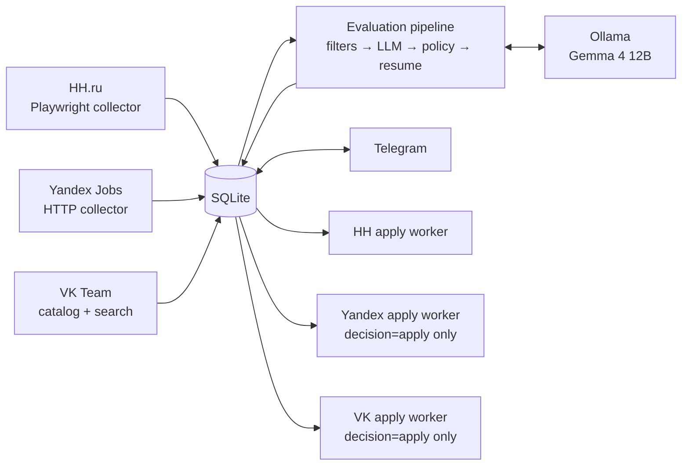
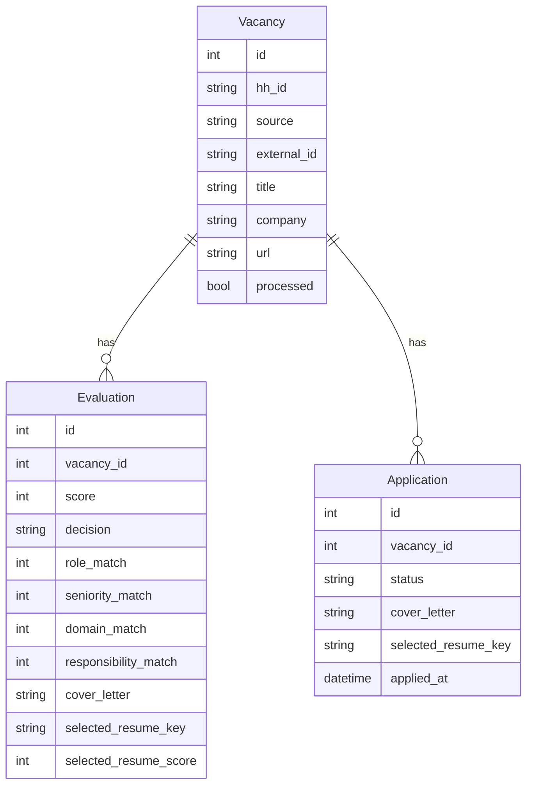

<div align="center">

# HH AGENT

**Автономный агент поиска, оценки и отклика на вакансии**  
Windows · Python 3.12 · Playwright · SQLite · Ollama · Telegram · GitHub Actions

[rudenko.one](https://rudenko.one/) · `main @ 79397da`

</div>

---

## 01 / Что это

HH Agent автоматизирует полный цикл работы с вакансиями:

- собирает вакансии с **HH.ru**, **Yandex Jobs** и **VK Team**;
- хранит вакансии, историю оценок и lifecycle отклика в **SQLite**;
- применяет hard filters до LLM;
- оценивает fit локальной моделью через **Ollama**;
- детерминированно корректирует management-кейсы;
- выбирает подходящее резюме;
- формирует vacancy-aware текст отклика;
- показывает результаты и runtime через **Telegram**;
- повторно показывает через `/new` карточки без решения;
- выполняет source-aware отклики на **HH**, **Yandex** и **VK**.

> [!IMPORTANT]
> Для **Yandex** и **VK** автоматическая отправка разрешена только если `Application.status=approved` и **latest Evaluation = `apply`**. `review` и `reject` автоматически не отправляются.

---

## 02 / Архитектура



Основная цепочка:

```text
hh_collect.py
    ↓
collect_careers.py       # Yandex + VK
    ↓
process_vacancies.py
    ↓
apply_dispatcher.py      # source-aware routing
```

Ключевой принцип: **collectors, evaluation и site adapters разделены**. UI конкретного сайта не должен определять scoring, policy или содержание текста отклика.

---

## 03 / Модель данных



### Vacancy

Сырой объект вакансии. Идентичность — `source + external_id`; `hh_id` сохранён как legacy unique key.

### Evaluation

История оценки вакансии: score, decision, 4 измерения fit, gaps/red flags, recommendation, текст отклика и выбранное резюме.

### Application

Жизненный цикл отклика: статус, фактически используемый текст и выбранное резюме.

---

## 04 / Evaluation pipeline

Порядок обработки фиксирован:

1. **Hard filters** — быстрые однозначные запреты до LLM.
2. **VacancyEvaluator** — structured response от Ollama.
3. **Evidence guard** — убирает ложные gaps, если профиль подтверждает опыт.
4. **Management policy** — детерминированная корректировка PM/Product management cases.
5. **Resume matcher** — выбирает одно из существующих резюме.
6. **Persistence** — сохраняется Evaluation и данные для Telegram/apply workflow.

Итоговый score считается Python-кодом:

```text
score =
    role_match           * 0.35 +
    seniority_match      * 0.20 +
    domain_match         * 0.15 +
    responsibility_match * 0.30
```

Параметры production-контура:

| Параметр | Значение |
|---|---:|
| `LLM_MODEL` | `gemma4:12b` |
| `LLM_BASE_URL` | `http://localhost:11434` |
| `LLM_TIMEOUT` | `180` |
| `LLM_MAX_RETRIES` | `2` |
| `LLM_NUM_CTX` | `16384` |
| `TELEGRAM_MIN_SCORE` | `72` |

---

## 05 / Резюме и текст отклика

Выбор резюме и генерация текста выполняются **до adapter layer**.

- используются только подтверждённые факты профиля;
- 2–3 наиболее релевантных факта связываются с задачами вакансии;
- запрещены placeholders и third-person формулировки;
- выбранный локальный PDF валидируется через `app/application_assets.py`;
- Yandex и VK перед отправкой загружают выбранный PDF в форму;
- VK поле `description` трактуется как **«Расскажи о себе»**;
- VK отдельно заполняет `social_links` и consent `agree`.

---

## 06 / Apply architecture

### HH

Отдельный Scheduler job:

```text
HH Agent - Apply
    ↓
background_apply.py
    ↓
apply_worker.py
```

HH worker получает только HH Applications.

### Yandex и VK

Yandex и VK проходят через общий source-aware dispatcher:

```text
background_pipeline.py
    ↓
apply_dispatcher.py
    ├─ yandex_apply_worker.py
    └─ vk_apply_worker.py
```

Guard для обоих внешних источников:

```text
Application.status == approved
AND latest Evaluation.decision == apply
```

`*_APPLY_LIVE=false` никогда не нажимает финальный submit.

### VK safety flow

VK worker:

- использует persistent profile `vk-browser-profile`;
- заполняет имя, email, телефон, «Расскажи о себе» и social links;
- загружает выбранное резюме;
- подтверждает consent checkbox;
- после submit позволяет вручную пройти CAPTCHA в headful-режиме;
- ограниченно ждёт фактический результат;
- учитывает success/failure markers и структурное исчезновение формы/submit.

> [!WARNING]
> Если submit уже был нажат, но результат остаётся неоднозначным, worker переводит Application в `manual_required`. **Повторный автоматический submit запрещён.**

---

## 07 / Статусы Application

| Status | Значение |
|---|---|
| `notified` | карточка показана в Telegram, решение ещё не принято |
| `approved` | пользователь разрешил отклик |
| `applying` | worker начал обработку |
| `waiting_captcha` | VK ждёт ручного прохождения CAPTCHA |
| `applied` | success подтверждён, `applied_at` заполнен |
| `manual_required` | автоматика остановилась безопасно |
| `apply_error` | техническая ошибка |
| `skipped` | пользователь пропустил вакансию |
| `company_blacklist` | компания отмечена для blacklist workflow |

---

## 08 / Windows Scheduler

Текущая production-схема на Windows:

| Task | Период | Entry point |
|---|---|---|
| `HH Agent - Pipeline` | каждые 30 минут | `background_pipeline.py` |
| `HH Agent - Apply` | каждые 10 минут | `background_apply.py` |
| `HH Agent - Resume Raise` | каждые 30 минут | `background_resume_raise.py` |
| `HH Agent - Telegram` | at logon + restart on failure | `run_telegram_hidden.vbs` → `telegram_bot_entry.py` |

Pipeline состоит из 4 этапов:

```text
1 / hh_collect.py
2 / collect_careers.py       # Yandex + VK
3 / process_vacancies.py
4 / apply_dispatcher.py       # source-aware guarded apply
```

`Pipeline`, `Apply` и `Resume Raise` используют общий **AgentLock**. Конфликтующий background browser job не стартует параллельно.

### Проверка Scheduler

```powershell
Get-ScheduledTask | Where-Object {$_.TaskName -like "*HH*"} |
    Select-Object TaskName, State

(Get-ScheduledTask -TaskName "HH Agent - Pipeline").Actions
(Get-ScheduledTask -TaskName "HH Agent - Apply").Actions
(Get-ScheduledTask -TaskName "HH Agent - Telegram").Actions

Get-ScheduledTaskInfo -TaskName "HH Agent - Pipeline"
```

---

## 09 / Установка Scheduler

```powershell
powershell -ExecutionPolicy Bypass -File C:\hh-agent\install_tasks.ps1
powershell -ExecutionPolicy Bypass -File C:\hh-agent\install_resume_raise_task.ps1
powershell -ExecutionPolicy Bypass -File C:\hh-agent\reinstall_telegram_task.ps1
```

Перезапуск Telegram после обновления кода:

```powershell
Stop-ScheduledTask -TaskName "HH Agent - Telegram"

Get-CimInstance Win32_Process |
    Where-Object { $_.CommandLine -match "telegram_bot_entry\.py" } |
    ForEach-Object { Stop-Process -Id $_.ProcessId -Force }

Start-ScheduledTask -TaskName "HH Agent - Telegram"
```

---

## 10 / Сессии браузера

| Source | Persistent profile |
|---|---|
| HH | `C:\hh-agent\browser-profile` |
| Yandex | `C:\hh-agent\yandex-browser-profile` |
| VK | `C:\hh-agent\vk-browser-profile` |

Проверка HH / Yandex:

```powershell
cd C:\hh-agent
.\.venv\Scripts\python.exe .\check_hh_session.py
.\.venv\Scripts\python.exe .\check_yandex_session.py
```

Профили браузеров, `.env`, БД, runtime и логи не коммитятся.

---

## 11 / Runtime и логи

Runtime state хранится в `data/runtime/`:

```text
pipeline.json
apply.json
resume_raise.json
telegram.json
```

Основные логи:

```text
logs/pipeline_supervisor.log
logs/collector.log
logs/careers_collector.log
logs/processor.log
logs/apply_dispatcher.log
logs/apply_supervisor.log
logs/apply_worker_runtime.log
logs/yandex_apply_worker.log
logs/yandex_apply_worker_attention.log
logs/vk_apply_worker.log
logs/vk_apply_worker_attention.log
logs/telegram.log
logs/resume_raise_supervisor.log
logs/resume_raise_worker.log
```

Полезные команды:

```powershell
Get-Content C:\hh-agent\logs\telegram.log -Tail 160
Get-Content C:\hh-agent\logs\apply_dispatcher.log -Tail 150
Get-Content C:\hh-agent\data\runtime\pipeline.json
```

---

## 12 / Telegram

Production entry point: `telegram_bot_entry.py`.

Команды:

| Command | Что делает |
|---|---|
| `/health` | healthcheck проекта, Ollama, runtime и очередей |
| `/status` | текущие background states |
| `/run` | запускает pipeline сейчас |
| `/new` | новые вакансии **+ все `notified` без решения** |
| `/stats` | статистика Application status |

Inline actions:

- `✅ Откликнуться` → `approved`;
- `❌ Пропустить` → `skipped`;
- `🚫 Компания в blacklist` → `company_blacklist`;
- source-aware ссылка → `Открыть HH / Yandex / VK`.

### Надёжность `/new`

`telegram_bot_pending_patch.py`:

- сначала выбирает все `Application.status=notified` независимо от текущего score;
- затем добавляет действительно новые вакансии выше `TELEGRAM_MIN_SCORE`;
- не создаёт повторные Application для уже существующих карточек;
- делает bounded retry при `NetworkError`, `TimedOut` и `RetryAfter`;
- выдерживает паузу между сообщениями;
- ошибка одной карточки не прерывает всю пачку;
- пишет подробную диагностику в `telegram.log`.

> [!CAUTION]
> Telegram bot сейчас работает в **public mode**: команды принимаются из любого Telegram chat. Ограничение доступа остаётся security backlog item.

---

## 13 / Environment

Ключевые переменные:

```text
LLM_PROVIDER=ollama
LLM_MODEL=gemma4:12b
LLM_BASE_URL=http://localhost:11434
LLM_TIMEOUT=180
LLM_MAX_RETRIES=2
LLM_THINK=false
LLM_NUM_CTX=16384

TELEGRAM_MIN_SCORE=72

HH_APPLY_HEADLESS=false
HH_APPLY_MAX_PER_RUN=10

YANDEX_APPLY_LIVE=false
YANDEX_APPLY_HEADLESS=true
YANDEX_APPLY_MAX_PER_RUN=5
YANDEX_APPLY_DELAY_SECONDS=3
YANDEX_APPLY_APPLICATION_ID=

VK_APPLY_LIVE=false
VK_APPLY_HEADLESS=false
VK_APPLY_MAX_PER_RUN=5
VK_APPLY_DELAY_SECONDS=3
VK_APPLY_APPLICATION_ID=
VK_APPLY_CAPTCHA_WAIT_SECONDS=300
VK_APPLY_SUCCESS_WAIT_SECONDS=10
VK_APPLY_NAME=
VK_APPLY_FIRST_NAME=
VK_APPLY_LAST_NAME=
VK_APPLY_EMAIL=
VK_APPLY_PHONE=
VK_APPLY_SOCIAL_LINKS=

APPLY_DISPATCH_HH=true
```

Не коммитить реальные токены, credentials и персональные значения form fields.

---

## 14 / Ручной запуск

### PowerShell

```powershell
cd C:\hh-agent
.\run_utf8.ps1 background_pipeline.py
```

### Точечный VK dry-run

```powershell
$env:VK_APPLY_APPLICATION_ID="<Application.id>"
$env:VK_APPLY_LIVE="false"
.\run_utf8.ps1 vk_apply_worker.py
```

### Точечный VK live-run

Использовать только после проверки конкретной Application и latest Evaluation:

```powershell
$env:VK_APPLY_APPLICATION_ID="<Application.id>"
$env:VK_APPLY_LIVE="true"
.\run_utf8.ps1 vk_apply_worker.py
```

Для Yandex действует тот же принцип targeted Application ID + `YANDEX_APPLY_LIVE=true`.

---

## 15 / Диагностика Application

Безопасная последовательность для внешнего source:

1. проверить `Application.id`, `status` и связанную Vacancy;
2. проверить **latest Evaluation**;
3. убедиться, что `decision=apply`;
4. проверить выбранный resume asset;
5. запускать targeted dry-run;
6. только после этого разрешать live submit;
7. после live-run проверить `status`, `applied_at` и worker logs.

Для уже нажатого submit действует отдельное правило: **не requeue и не повторять submit, пока не подтверждено, что отклик точно не ушёл**.

---

## 16 / Структура репозитория

```text
app/
  db.py
  evaluator.py
  evaluation_policy.py
  hard_filters.py
  role_filter.py
  resume_matcher.py
  application_assets.py

sources/
  base.py
  yandex.py
  vk.py

hh_collect.py
collect_careers.py
process_vacancies.py

apply_worker.py
apply_dispatcher.py
yandex_apply_worker.py
vk_apply_worker.py

background_common.py
background_pipeline.py
background_apply.py
background_resume_raise.py

telegram_bot.py
telegram_bot_entry.py
telegram_bot_link_patch.py
telegram_bot_pending_patch.py

.github/workflows/ci.yml

tests/
doc/HH_Agent_System_Documentation.pdf
```

---

## 17 / Safety invariants

Эти правила нельзя ломать рефакторингом:

1. **Source separation** — каждый worker получает только свой source.
2. **Yandex/VK auto = `apply` only** — одного `approved` недостаточно.
3. **No blind retry after submit** — неоднозначный результат не должен приводить к повторной отправке.
4. **Local resume source of truth** — перед отправкой валидируется и загружается выбранный PDF.
5. **Не удалять Evaluation history** — latest + история нужны для audit/safety.
6. **AgentLock обязателен** для background browser jobs.
7. **`/new` не меняет решения** — он только повторно показывает `notified` и создаёт Application для действительно новых карточек.

---

## 18 / Технический долг

- Telegram public mode требует ограничения доступа.
- `telegram_bot.py` пока дополняется runtime patch-модулями; позже их стоит консолидировать в основной модуль.
- `role_filter.py`: substring-проверка коротких role markers требует word-boundary regression coverage.
- Public sanitization перед открытием репозитория: история коммитов, персональные filenames/fixtures/docs.
- Production CD на Windows self-hosted runner ещё не реализован; сейчас есть Windows CI.

---

## 19 / Release checklist

Перед merge изменений в collectors / evaluator / apply / Telegram:

- читать **актуальный файл target-ветки** перед изменением;
- работать через отдельную branch + PR;
- проверить `git diff --check`, syntax/imports и unit tests;
- проверить source routing и latest-decision guard;
- проверить representative vacancies и итоговые `score / decision / recommendation / cover_letter`;
- для live submit использовать targeted Application ID;
- после live test проверить `status / applied_at` и логи;
- не делать повторный submit при неоднозначном результате;
- при изменении архитектуры обновлять **README** и `doc/HH_Agent_System_Documentation.pdf`.

---

<div align="center">

**HH AGENT / rudenko.one**

Документация актуализирована для `main @ 79397da` · 2026-08-26

</div>
