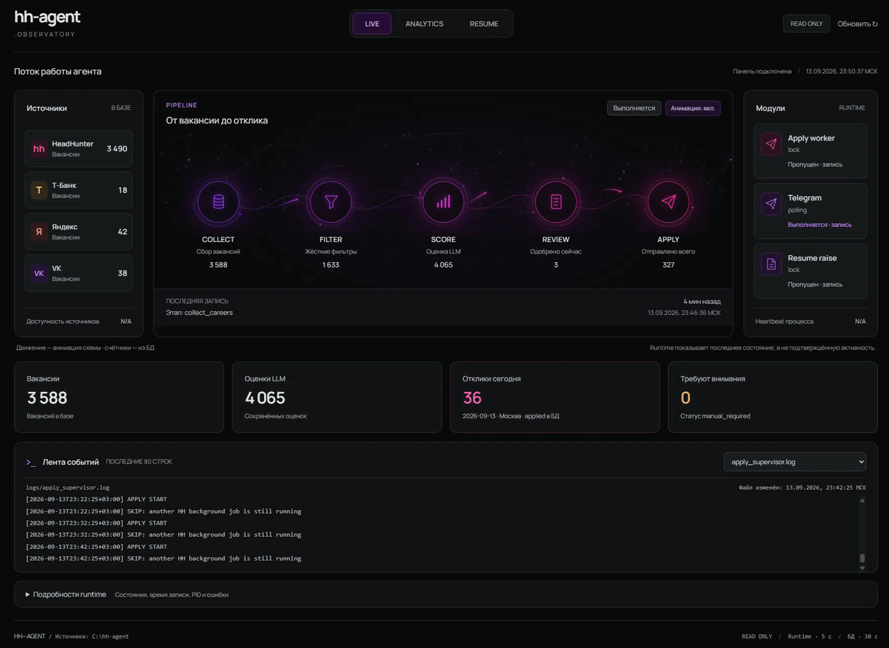
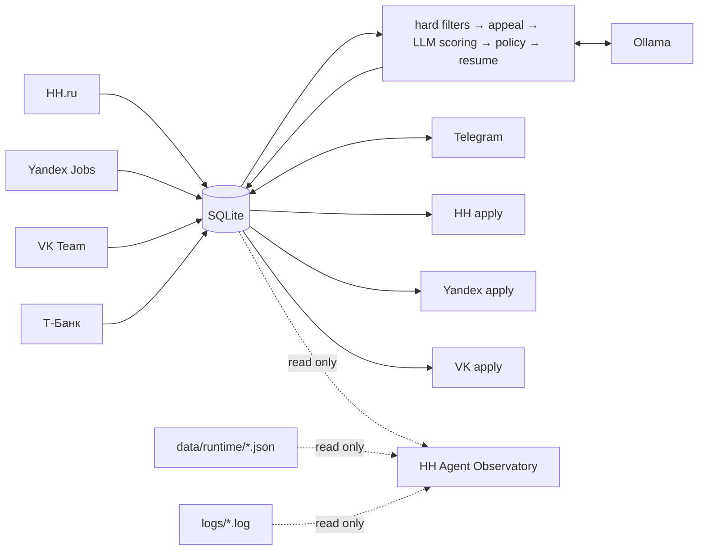
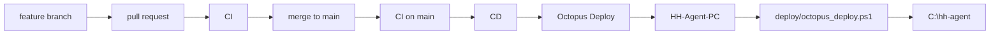

<div align="center">

# HH AGENT

**Автономный агент поиска работы: сбор вакансий → фильтрация → LLM-оценка → решение → контролируемый отклик**

Windows · Python 3.12 · Playwright · SQLite · Ollama · Telegram · FastAPI · GitHub Actions · Octopus Deploy

[rudenko.one](https://rudenko.one/)

</div>

---

<p align="center">
 
</p>

<p align="center"><sub>HH Agent Observatory — локальная read-only панель.</sub></p>

## Что это

HH Agent — локальный Windows-first агент, который автоматизирует большую часть рутинного цикла поиска работы, но оставляет финальное решение об отклике за пользователем.

Он собирает вакансии из нескольких источников, отбрасывает заведомо неподходящие, оценивает оставшиеся локальной LLM, подбирает резюме, готовит vacancy-aware сопроводительное, показывает рекомендации в Telegram и выполняет разрешённые отклики через source-specific workers.

| Контур | Что делает |
|---|---|
| **Discovery** | HH.ru, Yandex Jobs, VK Team, Т-Банк |
| **Filtering** | hard filters + LLM-апелляция спорных reject + role/domain policy |
| **Scoring** | локальный Ollama, structured evaluation, evidence guard, management policy |
| **Resume** | выбор профиля/резюме и single-resume experiment |
| **Cover letter** | генерация сопроводительного под конкретную вакансию |
| **Approval** | пользователь явно разрешает каждый отклик |
| **Apply** | HH, Yandex и VK через отдельные adapters |
| **Telegram** | очередь рекомендаций, health/status, ручной запуск, recovery |
| **Resume Raise** | отдельный supervisor с расписанием по доступности HH |
| **Observatory** | read-only LIVE / ANALYTICS / RESUME dashboard |
| **Targeted Hunt** | поиск точки входа и контакта в компании |
| **CI/CD** | PR-first GitHub Actions → Octopus Deploy → production PC |

> [!IMPORTANT]
> `Application.status=approved` — явное разрешение пользователя на отправку. Для Yandex/VK финальный submit дополнительно контролируется operational switch `*_APPLY_LIVE=true`.

> [!NOTE]
> Т-Банк сейчас используется как source/discovery. Отдельного автоматического apply worker для него нет.

---

## Архитектура



Фоновый pipeline:

```text
check_hh_session
    ↓
hh_collect_optimized.py
    ↓
collect_careers.py
    ↓
process_vacancies.py
```

Отклики работают отдельно:

```text
background_apply.py
    ↓
apply_dispatcher.py
    ├─ HH      → apply_worker.py
    ├─ Yandex  → yandex_apply_worker.py
    └─ VK      → vk_apply_worker.py
```

Collectors, evaluation, user approval и site adapters разделены: UI конкретного сайта не должен определять scoring, policy или содержание сопроводительного письма.

---

## HH Agent Observatory

`dashboard/` — локальная read-only панель. Она не управляет worker'ами и не меняет business state.

В панели есть:

- **LIVE** — схема `COLLECT → FILTER → SCORE → REVIEW → APPLY`, источники, runtime и последние события;
- **ANALYTICS** — отклики по дням, распределение LLM score и накопленные показатели;
- **RESUME** — метрики single-resume experiment;
- tail выбранных логов и runtime pipeline / apply / Telegram / resume raise.

Открыть: `http://127.0.0.1:8765`

Подробности: [`dashboard/README.md`](dashboard/README.md).

---

## Evaluation pipeline

Порядок обработки:

1. hard filters;
2. LLM-апелляция appealable hard reject;
3. structured evaluation через Ollama;
4. evidence guard;
5. management policy;
6. resume matcher;
7. сохранение Evaluation и данных для apply workflow.

Базовый score:

```text
role_match           * 0.35 +
seniority_match      * 0.20 +
domain_match         * 0.15 +
responsibility_match * 0.30
```

При занятом GPU или временной ошибке Ollama scoring/appeal откладывается: вакансия остаётся pending и будет обработана следующим проходом. Длинный здоровый batch не убивается общим wall-clock timeout; таймауты остаются на уровне отдельных внешних операций.

---

## Telegram

Production entry point: `telegram_bot_entry.py`.

| Команда | Что делает |
|---|---|
| `/health` | healthcheck + runtime + очереди |
| `/status` | состояния background jobs + approved queue |
| `/run` | запускает pipeline сейчас |
| `/new` | unresolved карточки и новые рекомендации |
| `/stats` | статистика Application status |

Доставка `/new` выполняется в background task и не блокирует event loop бота.

> [!CAUTION]
> Telegram bot сейчас работает в public mode. Access control / allow-list остаётся security backlog item.

---

## Windows Scheduler

| Task | Период | Entry point |
|---|---|---|
| `HH Agent - Pipeline` | каждые 2 часа | `background_pipeline.py` |
| `HH Agent - Apply` | каждые 10 минут | `background_apply.py` |
| `HH Agent - Resume Raise` | проверка каждые 5 минут | `background_resume_raise.py` |
| `HH Agent - Telegram` | при logon + restart policy | `telegram_bot_entry.py` |
| `HH Agent - Dashboard` | при logon + restart policy | `dashboard` |

Pipeline, Apply и Resume Raise используют общий **AgentLock**, поэтому конфликтующие browser jobs не запускаются параллельно.

---

## CI/CD и production deployment

Все изменения в `main` проходят через branch + PR. После merge production checkout на `HH-Agent-PC` обновляется автоматически через GitHub Actions и Octopus Deploy.



Фактическая цепочка:

```text
branch → PR → CI → merge → CI main → CD → Octopus → HH-Agent-PC → C:\hh-agent
```

Deployment-логика живёт в [`deploy/octopus_deploy.ps1`](deploy/octopus_deploy.ps1). Octopus хранит только небольшой launcher, который запускает этот versioned script на target machine.

### Защита production checkout

- deployment ждёт освобождения общего `AgentLock` до 2 часов, если Pipeline / Apply / Resume Raise уже работает;
- затем удерживает `AgentLock` на время Git update и sanity checks;
- tracked локальные изменения блокируют deployment и никогда не сбрасываются автоматически;
- harmless untracked-файлы допускаются и остаются на месте;
- чистый checkout может автоматически вернуться с feature branch на `main`;
- update разрешён только fast-forward к `origin/main`;
- после обновления выполняются Python sanity checks;
- Telegram перезапускается только при релевантных изменениях;
- при ошибке post-update validation repository возвращается к предыдущему SHA.

CI на Windows / Python 3.12 проверяет whitespace, компиляцию Python, синтаксис deployment PowerShell и core unit tests.

> [!NOTE]
> GitHub CD подтверждает создание deployment в Octopus. Финальный target-side результат проверяется в Octopus отдельно.

### Проверка deployment на машине

```powershell
cd C:\hh-agent
& "C:\Program Files\Git\cmd\git.exe" rev-parse HEAD
& "C:\Program Files\Git\cmd\git.exe" rev-parse origin/main
& "C:\Program Files\Git\cmd\git.exe" status --short
```

`HEAD` и `origin/main` должны совпадать. Подробности: [`doc/ci_cd.md`](doc/ci_cd.md).

---

## Runtime и логи

Runtime:

```text
data/runtime/pipeline.json
data/runtime/apply.json
data/runtime/resume_raise.json
data/runtime/telegram.json
```

Основные логи:

```text
logs/pipeline_supervisor.log
logs/collector.log
logs/careers_collector.log
logs/processor.log
logs/apply_dispatcher.log
logs/apply_supervisor.log
logs/telegram.log
logs/resume_raise_supervisor.log
logs/resume_raise_worker.log
```

Профили браузеров, `.env`, БД, runtime и логи не коммитятся.

---

## Safety invariants

1. **Source separation** — worker не забирает очередь другого source.
2. **User approval is authoritative** — `approved` означает явное разрешение пользователя.
3. **External live switch** — Yandex/VK final submit требует `*_APPLY_LIVE=true`.
4. **No blind retry after submit** — неоднозначный результат не приводит к повторной отправке.
5. **Evaluation history remains auditable** — история оценок сохраняется.
6. **AgentLock** обязателен для конфликтующих browser jobs и production deployment.
7. **`/new` не переписывает решения** — только восстанавливает unresolved карточки и добавляет новые.
8. **Т-Банк не является automatic-apply source**, пока нет отдельного adapter.
9. **Изменения в `main` — только через branch + PR.**
10. **Production update — fast-forward only**; tracked локальные изменения не уничтожаются деплоем.

---

## Структура репозитория

```text
.github/workflows/       # CI + CD
deploy/                  # Octopus deployment logic
app/                     # evaluation, DB, policies, resume, Targeted Hunt
sources/                 # Yandex / VK / T-Bank collectors
dashboard/               # FastAPI + local Observatory UI
tests/                   # regression tests
doc/                     # system and feature documentation

hh_collect_optimized.py
collect_careers.py
process_vacancies.py
apply_dispatcher.py
apply_worker.py
yandex_apply_worker.py
vk_apply_worker.py
background_pipeline.py
background_apply.py
background_resume_raise.py
telegram_bot_entry.py
resume_raise_worker_v2.py
run_hidden.vbs

deploy/octopus_deploy.ps1
deploy/agent_lock_holder.py
```

---

## Документация

- [CI/CD and production deployment](doc/ci_cd.md)
- [HH Agent Observatory](dashboard/README.md)
- [Single-resume experiment](doc/single_resume_experiment.md)
- [Targeted Hunt](doc/targeted_hunt.md)
- [HH apply success detection](doc/hh_apply_success_detection.md)
- [System documentation](doc/HH_Agent_System_Documentation.md)
- [System documentation PDF](doc/HH_Agent_System_Documentation.pdf)
- [License](LICENSE)

---

<div align="center">

**HH AGENT / rudenko.one**

Local-first automation with explicit user approval.

</div>