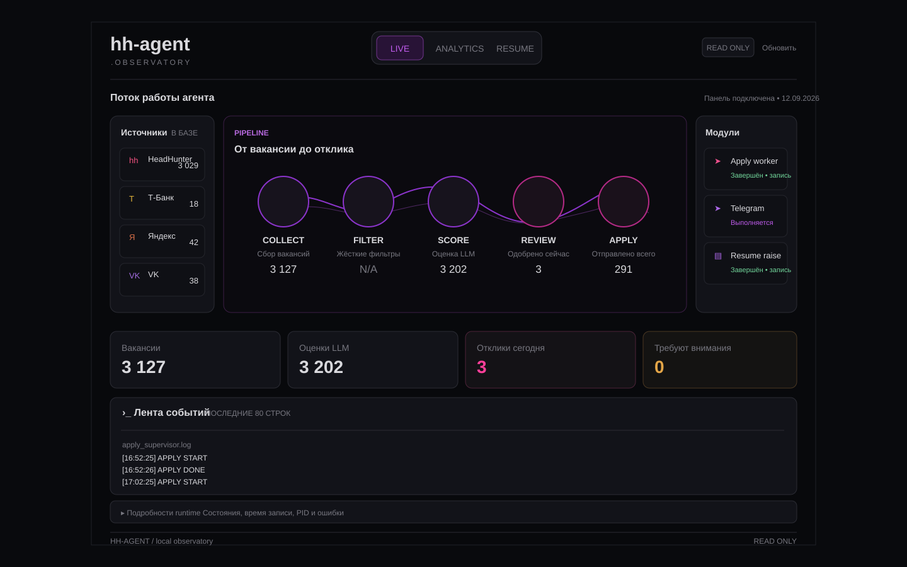
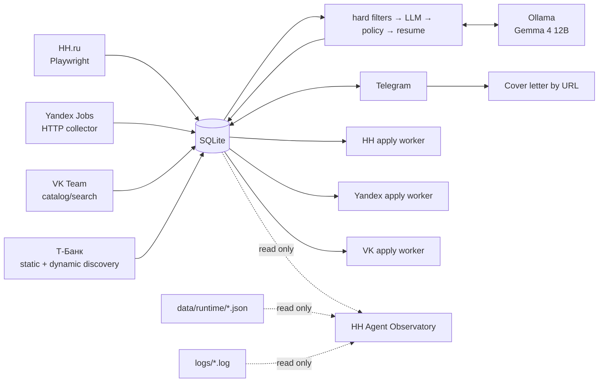

<div align="center">

# HH AGENT

**Автономный агент поиска работы: сбор вакансий → фильтрация → LLM-оценка → решение → контролируемый отклик**

Windows · Python 3.12 · Playwright · SQLite · Ollama · Telegram · FastAPI

[rudenko.one](https://rudenko.one/)

</div>

---

<p align="center">
  
</p>

<p align="center"><sub>HH Agent Observatory — локальная read-only панель состояния, аналитики и логов. На иллюстрации показан пример состояния.</sub></p>

## Что это

HH Agent — локальный Windows-first агент, который автоматизирует большую часть рутинного цикла поиска работы, но оставляет финальное решение об отклике за пользователем.

Он собирает вакансии из нескольких источников, отбрасывает заведомо неподходящие, оценивает оставшиеся локальной LLM, подбирает резюме, готовит vacancy-aware сопроводительное, показывает рекомендации в Telegram и выполняет разрешённые отклики через source-specific workers.

### Основные возможности

| Контур | Что делает |
|---|---|
| **Discovery** | HH.ru, Yandex Jobs, VK Team, Т-Банк |
| **Filtering** | hard filters до LLM + role/domain policy |
| **Scoring** | локальный Ollama, structured evaluation, evidence guard |
| **Resume** | выбор профиля/резюме и single-resume experiment |
| **Cover letter** | генерация сопроводительного под конкретную вакансию |
| **Approval** | пользователь явно разрешает каждый отклик |
| **Apply** | HH, Yandex и VK через отдельные adapters |
| **Telegram** | очередь рекомендаций, health/status, ручной запуск, recovery |
| **Resume Raise** | отдельный supervisor с расписанием по доступности HH |
| **Observatory** | read-only LIVE / ANALYTICS / RESUME dashboard |
| **Targeted Hunt** | отдельный контур поиска точки входа и контакта в компании |

> [!IMPORTANT]
> `Application.status=approved` — явное разрешение пользователя на отправку. Для Yandex/VK финальный submit дополнительно контролируется operational switch `*_APPLY_LIVE=true`.

> [!NOTE]
> Т-Банк сейчас используется как source/discovery. Отдельного автоматического apply worker для него нет.

---

## Архитектура



Фоновый pipeline:

```text
check_hh_session
    ↓
hh_collect.py
    ↓
collect_careers.py       # Yandex + VK + Т-Банк
    ↓
process_vacancies.py
```

Отклики работают отдельно:

```text
background_apply.py
    ↓
apply_dispatcher.py
    ├─ HH      → apply_worker.py
    ├─ Yandex  → yandex_apply_worker.py
    └─ VK      → vk_apply_worker.py
```

Ключевой принцип проекта: **collectors, evaluation, user approval и site adapters разделены**. UI конкретного сайта не должен определять scoring, policy или содержание сопроводительного письма.

---

## HH Agent Observatory

`dashboard/` — полностью отдельная локальная панель наблюдения за агентом. Она не управляет worker'ами и не меняет business state.

### Что видно

- **LIVE** — схема `COLLECT → FILTER → SCORE → REVIEW → APPLY`, источники, runtime модулей и последние события;
- **ANALYTICS** — отклики по дням, распределение LLM score и накопленные показатели;
- **RESUME** — метрики single-resume experiment;
- runtime состояния pipeline / apply / Telegram / resume raise;
- tail выбранных логов;
- счётчики вакансий, оценок, откликов и `manual_required`.

Счётчики схемы относятся к разным сохранённым данным, а не к одной сквозной воронке. Анимация декоративная; возраст runtime-записи и PID не подтверждают активность процесса. Браузер обновляет данные каждые 5 секунд, снимок БД кэшируется на 30 секунд. В RESUME параметры эксперимента заданы в панели и не проверяют `data/resumes.yaml`; просмотры и приглашения показываются как `N/A`, поскольку данных нет.

Dashboard читает SQLite через `mode=ro` + `PRAGMA query_only=ON`, runtime JSON и фиксированный список логов. Он доступен только локально и не является heartbeat/контроллером агента.

### Запуск

Первичная установка:

```powershell
cd C:\hh-agent
py -3.12 -m venv dashboard\.venv
.\dashboard\.venv\Scripts\python.exe -m pip install -r dashboard\requirements.txt
```

Запуск панели:

```powershell
cd C:\hh-agent
.\dashboard\.venv\Scripts\python.exe -m dashboard --source-root C:\hh-agent
```

Открыть:

```text
http://127.0.0.1:8765
```

После установки зависимостей `install_dashboard_task.ps1` создаёт задачу `HH Agent - Dashboard` и сразу запускает её. При следующем входе в Windows панель стартует через `dashboard\.venv\Scripts\pythonw.exe` без консольного окна; при сбое настроен перезапуск через минуту. Если задача уже работает на порту 8765, второй ручной запуск не нужен.

Подробности по ограничениям, read-only модели и тестам: [`dashboard/README.md`](dashboard/README.md).

---

## Источники и отклики

| Source | Collection | Apply |
|---|---|---|
| **HH** | Playwright, рекомендации + fallback search | автоматический после `approved` |
| **Yandex** | career HTTP collector | `approved` + `YANDEX_APPLY_LIVE=true` |
| **VK** | catalog/search collector | `approved` + `VK_APPLY_LIVE=true` |
| **Т-Банк** | static pagination + dynamic Playwright discovery | ручной контур |

### Permission model

```text
Application.status == approved
AND <SOURCE>_APPLY_LIVE == true     # Yandex / VK
```

Для HH используется собственный worker. Для Yandex/VK `approved` остаётся решением пользователя, а `*_APPLY_LIVE` — operational kill switch.

**Особенность фонового запуска:** `background_apply.py` явно передаёт `YANDEX_APPLY_LIVE=true` и `VK_APPLY_LIVE=true` дочернему dispatcher. Значения `false` в `.env` не отключают отправку через этот supervisor; `approved` по-прежнему обязателен. Для проверки без отправки используйте прямой targeted dry-run worker из раздела «Ручной запуск».

Если submit уже мог произойти, но результат нельзя подтвердить однозначно, Application переводится в `manual_required`. **Blind retry после потенциальной отправки запрещён.**

---

## Evaluation pipeline

Порядок обработки:

1. hard filters;
2. structured evaluation через Ollama;
3. evidence guard;
4. management policy;
5. resume matcher;
6. сохранение Evaluation и данных для apply workflow.

Базовый score:

```text
role_match           * 0.35 +
seniority_match      * 0.20 +
domain_match         * 0.15 +
responsibility_match * 0.30
```

Defaults:

```text
LLM_MODEL=gemma4:12b
LLM_BASE_URL=http://localhost:11434
LLM_TIMEOUT=180
LLM_MAX_RETRIES=2
LLM_NUM_CTX=16384

PROCESSOR_LLM_TIMEOUT_SECONDS=60
PROCESSOR_LLM_MAX_RETRIES=0
PROCESSOR_MAX_CONSECUTIVE_LLM_DEFERS=2

TELEGRAM_MIN_SCORE=72
GPU_GUARD_ENABLED=true
```

При занятом GPU или временной ошибке Ollama scoring откладывается: вакансия остаётся pending и будет обработана следующим проходом.

---

## Telegram

Production entry point: `telegram_bot_entry.py`.

| Команда | Что делает |
|---|---|
| `/health` | healthcheck + runtime + очереди |
| `/status` | состояния background jobs + approved queue |
| `/run` | запускает pipeline сейчас |
| `/new` | возвращает unresolved карточки и новые рекомендации |
| `/stats` | статистика Application status |

Бот также умеет принять URL вакансии и подготовить отдельное copy-ready сопроводительное письмо.

> [!CAUTION]
> Telegram bot сейчас работает в public mode. Access control / allow-list остаётся security backlog item.

---

## Windows Scheduler

| Task | Период | Entry point |
|---|---|---|
| `HH Agent - Pipeline` | каждые 2 часа | `background_pipeline.py` |
| `HH Agent - Apply` | каждые 10 минут | `background_apply.py` |
| `HH Agent - Resume Raise` | проверка каждые 5 минут, фактическое поднятие по доступности HH | `background_resume_raise.py` |
| `HH Agent - Telegram` | при logon + restart policy | `telegram_bot_entry.py` |
| `HH Agent - Dashboard` | при logon + restart через минуту | `dashboard\.venv\Scripts\pythonw.exe -m dashboard` |

Pipeline, Apply и Resume Raise используют общий **AgentLock**, поэтому конфликтующие browser jobs не запускаются параллельно.

Установка основных задач:

```powershell
powershell -ExecutionPolicy Bypass -File C:\hh-agent\install_tasks.ps1
powershell -ExecutionPolicy Bypass -File C:\hh-agent\install_resume_raise_task.ps1
powershell -ExecutionPolicy Bypass -File C:\hh-agent\install_dashboard_task.ps1
```

---

## Ручной запуск

```powershell
cd C:\hh-agent

# Pipeline
.\run_utf8.ps1 background_pipeline.py

# Telegram
.\.venv\Scripts\python.exe .\telegram_bot_entry.py

# Resume Raise
.\.venv\Scripts\python.exe .\resume_raise_worker_v2.py

# Observatory
.\dashboard\.venv\Scripts\python.exe -m dashboard --source-root C:\hh-agent
```

Targeted Yandex/VK dry-run:

```powershell
$env:YANDEX_APPLY_APPLICATION_ID="<Application.id>"
$env:YANDEX_APPLY_LIVE="false"
.\run_utf8.ps1 yandex_apply_worker.py

$env:VK_APPLY_APPLICATION_ID="<Application.id>"
$env:VK_APPLY_LIVE="false"
.\run_utf8.ps1 vk_apply_worker.py
```

---

## Runtime и логи

Runtime:

```text
data/runtime/pipeline.json
data/runtime/apply.json
data/runtime/resume_raise.json
data/runtime/telegram.json
```

Основные логи:

```text
logs/pipeline_supervisor.log
logs/collector.log
logs/careers_collector.log
logs/processor.log
logs/apply_dispatcher.log
logs/apply_supervisor.log
logs/apply_worker_runtime.log
logs/yandex_apply_worker.log
logs/vk_apply_worker.log
logs/telegram.log
logs/resume_raise_supervisor.log
logs/resume_raise_worker.log
```

Профили браузеров, `.env`, БД, runtime и логи не коммитятся.

---

## Safety invariants

1. **Source separation** — worker не забирает очередь другого source.
2. **User approval is authoritative** — `approved` означает явное разрешение пользователя.
3. **External live switch** — Yandex/VK final submit требует `*_APPLY_LIVE=true`.
4. **No blind retry after submit** — неоднозначный результат не приводит к повторной отправке.
5. **Resume assets** — Yandex/VK валидируют локальный PDF; HH использует резюме в HH UI.
6. **Evaluation history remains auditable** — история оценок сохраняется.
7. **AgentLock** обязателен для конфликтующих browser jobs.
8. **`/new` не переписывает решения** — только восстанавливает unresolved карточки и добавляет новые.
9. **Т-Банк не является automatic-apply source**, пока нет отдельного adapter.
10. **Изменения в `main` — только через branch + PR.**

---

## Структура репозитория

```text
app/                    # evaluation, DB, policies, resume, Targeted Hunt
sources/                # Yandex / VK / T-Bank collectors
dashboard/              # FastAPI + local Observatory UI
tests/                  # core regression tests
doc/                    # system and feature documentation

hh_collect.py
collect_careers.py
process_vacancies.py

apply_dispatcher.py
apply_worker.py
yandex_apply_worker.py
vk_apply_worker.py

background_pipeline.py
background_apply.py
background_resume_raise.py

telegram_bot.py
telegram_bot_entry.py

resume_raise_worker_v2.py
configure_single_resume.py

install_tasks.ps1
install_resume_raise_task.ps1
install_dashboard_task.ps1
```

---

## Документация

- [HH Agent Observatory](dashboard/README.md)
- [Single-resume experiment](doc/single_resume_experiment.md)
- [Targeted Hunt](doc/targeted_hunt.md)
- [HH apply success detection](doc/hh_apply_success_detection.md)

Системная документация ниже — исторический snapshot; актуальные режимы описаны в README и документах отдельных модулей.

- [System documentation](doc/HH_Agent_System_Documentation.md)
- [System documentation PDF](doc/HH_Agent_System_Documentation.pdf)
- [License](LICENSE)

---

<div align="center">

**HH AGENT / rudenko.one**

Local-first automation with explicit user approval.

</div>
