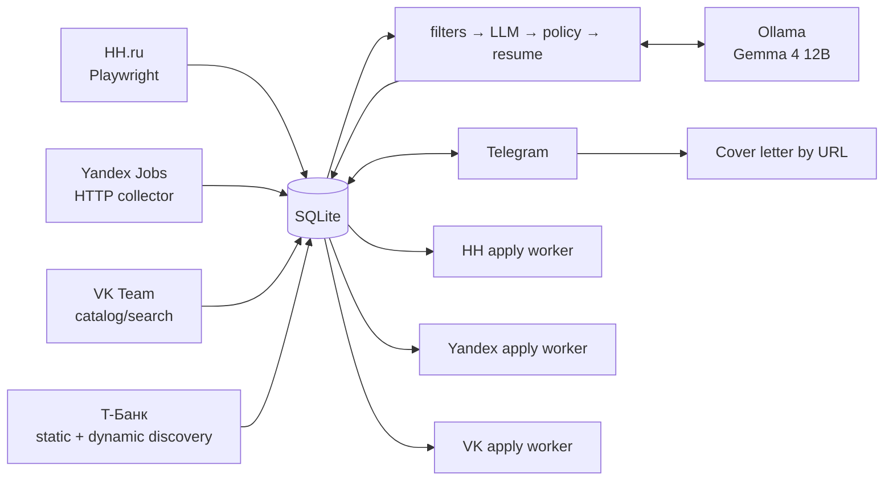
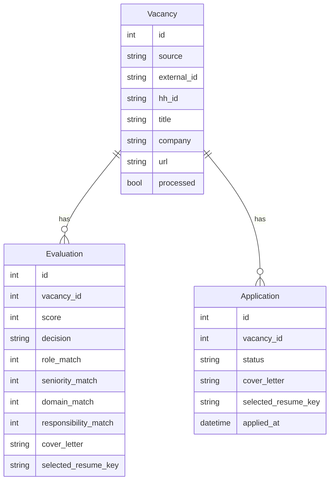

<div align="center">

# HH AGENT

**Автономный агент поиска, оценки и контролируемого отклика на вакансии**
Windows · Python 3.12 · Playwright · SQLite · Ollama · Telegram · GitHub Actions

[rudenko.one](https://rudenko.one/) · code snapshot `main @ ae848b1` · 2026-09-12

</div>

---

## 01 / Что это

HH Agent автоматизирует основной цикл поиска работы:

- собирает вакансии с **HH.ru**, **Yandex Jobs**, **VK Team** и **Т-Банка**;
- хранит вакансии, историю оценок и lifecycle отклика в **SQLite**;
- применяет hard filters до LLM;
- оценивает fit локальной моделью через **Ollama**;
- выбирает подходящее резюме и формирует vacancy-aware сопроводительное;
- поддерживает single-resume experiment: четыре логических профиля указывают на одно HH-резюме;
- показывает вакансии, очереди и runtime через **Telegram**;
- восстанавливает через `/new` unresolved `notified` и `manual_required` карточки;
- выполняет source-aware отклики на **HH**, **Yandex** и **VK**;
- умеет по присланной в Telegram ссылке подготовить отдельное copy-ready сопроводительное письмо.

> [!IMPORTANT]
> **`Application.status=approved` — финальное явное разрешение пользователя на отправку.** Для Yandex/VK финальный submit дополнительно требует operational switch `*_APPLY_LIVE=true`. Старое правило `approved + latest Evaluation=apply` больше не соответствует текущему `apply_dispatcher.py`.

> [!NOTE]
> **Т-Банк сейчас подключён как source/discovery.** Отдельного автоматического apply worker для него нет.

---

## 02 / Архитектура



Фоновый pipeline (`background_pipeline.py`):

```text
check_hh_session
    ↓
hh_collect.py
    ↓
collect_careers.py       # Yandex + VK + Т-Банк
    ↓
process_vacancies.py
```

Отклики выполняются отдельной задачей: `background_apply.py → apply_dispatcher.py → HH / Yandex / VK workers`. Processor сохраняет оценки; Telegram создаёт Application при показе карточки и переводит её в `approved` по нажатию «Откликнуться».

Ключевой принцип: **collectors, evaluation и site adapters разделены**. UI конкретного сайта не должен определять scoring, policy или содержание сопроводительного письма.

---

## 03 / Источники

| Source | Collection | Apply | Основная реализация |
|---|---|---|---|
| HH | Playwright, рекомендации + fallback search | автоматический после `approved` | `hh_collect.py`, `apply_worker.py` |
| Yandex | career HTTP collector | `approved` + `YANDEX_APPLY_LIVE=true` | `sources/yandex.py`, `yandex_apply_worker.py` |
| VK | catalog/search collector | `approved` + `VK_APPLY_LIVE=true` | `sources/vk.py`, `vk_apply_worker.py` |
| Т-Банк | static pagination + dynamic Playwright discovery | ручной контур | `sources/tbank.py` |

### Т-Банк

`TBankSource`:

- обходит IT и общий московский каталог;
- поддерживает vacancy paths `it` и `back-office`;
- сначала собирает ссылки статически по страницам;
- затем запускает dynamic discovery для lazy-loaded каталога;
- дедуплицирует карточки по UUID;
- отбрасывает закрытые и нерелевантные вакансии до LLM;
- делает bounded retry HTTP-запросов, включая `429`;
- падение одного карьерного source не останавливает остальные источники.

---

## 04 / Модель данных



`Vacancy` хранит нормализованный source/external identity. `Evaluation` — append-only история оценки и контекст для audit. `Application` — пользовательское решение и фактический operational lifecycle отклика.

После ручного `approved` история Evaluation остаётся важным audit-контекстом, но **не является вторым veto-gate для Yandex/VK**.

---

## 05 / Evaluation pipeline

Порядок обработки:

1. **Hard filters** — быстрые однозначные запреты до LLM.
2. **VacancyEvaluator** — structured response от Ollama.
3. **Evidence guard** — убирает ложные gaps при наличии подтверждённого опыта.
4. **Management policy** — детерминированная корректировка management cases.
5. **Resume matcher** — выбирает подходящее существующее резюме.
6. **Persistence** — сохраняет Evaluation и данные для Telegram/apply workflow.

```text
score =
    role_match           * 0.35 +
    seniority_match      * 0.20 +
    domain_match         * 0.15 +
    responsibility_match * 0.30
```

Базовые LLM defaults (processor имеет отдельные overrides ниже):

| Параметр | Значение |
|---|---:|
| `LLM_MODEL` | `gemma4:12b` |
| `LLM_BASE_URL` | `http://localhost:11434` |
| `LLM_TIMEOUT` | `180` |
| `LLM_MAX_RETRIES` | `2` |
| `LLM_NUM_CTX` | `16384` |
| `TELEGRAM_MIN_SCORE` | `72` |

`process_vacancies.py` задаёт `LLM_TIMEOUT` и `LLM_MAX_RETRIES` из `PROCESSOR_LLM_TIMEOUT_SECONDS=60` и `PROCESSOR_LLM_MAX_RETRIES=0`. Это таймаут одного транспортного запроса: evaluator может повторять запрос при проверке structured response.

При занятом GPU scoring откладывается, а текущая и оставшиеся вакансии сохраняют `processed=False`. При временных transport/timeout ошибках Ollama вакансия также остаётся pending; после `PROCESSOR_MAX_CONSECUTIVE_LLM_DEFERS=2` подряд processor до конца прохода выполняет только hard filters. Следующий запуск повторит pending вакансии. Поэтому успешное завершение pipeline не означает, что вся очередь уже оценена.

---

## 06 / Резюме и сопроводительные

Выбор резюме и генерация текста выполняются до adapter layer:

- используются только подтверждённые факты профиля;
- 2–3 релевантных факта связываются с задачами вакансии;
- запрещены placeholders и third-person формулировки;
- локальный PDF для Yandex/VK валидируется через `app/application_assets.py`;
- Yandex/VK загружают выбранный resume asset в форму;
- VK отдельно заполняет about/social/consent поля.

### Single-resume experiment

Для эксперимента с одним физическим резюме HH сохраняются четыре обязательных ключа в `data/resumes.yaml`: `project`, `delivery`, `technical_project`, `product`. Matcher продолжает выбирать `selected_resume_key`, но все четыре записи получают одинаковые `hh_resume_id`, title и metadata исходного профиля.

Из корня репозитория, при уже настроенном `data/resumes.yaml`:

**PowerShell:**

```powershell
cd C:\hh-agent
.\.venv\Scripts\python.exe .\configure_single_resume.py --resume-id "<HH_RESUME_ID>" --title "<RESUME_TITLE>"
```

**Git Bash на Windows:**

```bash
cd /c/hh-agent
./.venv/Scripts/python.exe ./configure_single_resume.py --resume-id "<HH_RESUME_ID>" --title "<RESUME_TITLE>"
```

`--resume-id` — ID единственного используемого резюме на HH; в YAML поле называется `hh_resume_id`. Скрипт:

1. сохраняет текущий YAML в `data/resumes.yaml.bak-single-resume`;
2. копирует metadata из `--source-key` (по умолчанию `delivery`) во все четыре ключа;
3. задаёт общий ID и заголовок, очищает `generated_resumes`, устанавливает `strategy.fallback_resume` в выбранный source key.

Повторный запуск перезаписывает backup. Скрипт меняет только локальную конфигурацию: не редактирует резюме на HH, не создаёт PDF и не переписывает историю БД. Scoring и hard filters остаются прежними; четыре ключа удалять нельзя.

**HH:** эксперимент предполагает одно доступное резюме в форме отклика. Текущий browser worker выбирает единственный вариант, если его требуется отметить; он не ищет среди нескольких резюме по сохранённому `hh_resume_id`. Для Resume Raise специальная настройка не нужна: worker проверяет доступные поднятия в HH UI.

**Yandex/VK:** без `--file-path` все ключи наследуют прежний `file_path` выбранного source key. Новый заголовок HH не обновляет содержимое локального PDF. Чтобы использовать один обновлённый PDF, добавьте к команде `--file-path "data/resumes/resume.pdf"`; файл нужно подготовить отдельно. Подробности: [`doc/single_resume_experiment.md`](doc/single_resume_experiment.md).

### Сопроводительное по ссылке в Telegram

Если прислать боту URL вакансии:

1. `app/vacancy_url.py` нормализует URL и определяет известный source;
2. если в БД уже есть готовое письмо, используется cached Evaluation;
3. HH/Yandex/VK получают описание source-aware способом;
4. другой публичный HTTP(S)-сайт читается generic fetch с защитой от localhost/private networks и bounded redirects;
5. Ollama генерирует письмо по локальному резюме и preferences;
6. Telegram отправляет metadata и затем отдельное copy-ready письмо.

---

## 07 / Apply architecture

### HH

```text
HH Agent - Apply
    ↓
background_apply.py
    ↓
apply_dispatcher.py
    ↓
apply_worker.py
```

HH worker получает только `approved` для `source=hh` и legacy `source IS NULL`.

### Yandex / VK

```text
apply_dispatcher.py
    ├─ yandex_apply_worker.py
    └─ vk_apply_worker.py
```

Текущий permission model:

```text
Application.status == approved
AND <SOURCE>_APPLY_LIVE == true
```

`approved` — решение пользователя. `*_APPLY_LIVE=false` — operational kill switch: worker не нажимает финальный submit.

У фонового запуска есть важная особенность: `background_apply.py` явно передаёт `YANDEX_APPLY_LIVE=true` и `VK_APPLY_LIVE=true` дочернему dispatcher. Значения `false` в `.env` не отключают отправку через этот supervisor. Для проверки без отправки используйте прямой targeted dry-run worker из раздела 14. Разрешение `approved` требуется и в фоновом режиме.

### No blind retry

Если submit уже мог быть отправлен, но сайт не дал однозначного результата, Application переводится в `manual_required`. **Повторный автоматический submit запрещён**, пока человек не подтвердит, что первый отклик точно не ушёл.

---

## 08 / Application statuses

| Status | Значение |
|---|---|
| `notified` | карточка показана, решения нет |
| `approved` | пользователь разрешил отклик |
| `applying` | worker начал обработку |
| `waiting_captcha` | требуется ручное действие/CAPTCHA |
| `applied` | success подтверждён, заполнен `applied_at` |
| `manual_required` | автоматика безопасно остановилась и нужен человек |
| `apply_error` | техническая ошибка до подтверждённой отправки |
| `skipped` | пользователь пропустил вакансию |
| `company_blacklist` | компания отмечена для blacklist workflow |

`application_notifications.py` отправляет best-effort Telegram alert для `manual_required`: вакансия, компания, причина, `Application ID` и кнопка ручного открытия. `/new` повторно восстанавливает эти карточки.

---

## 09 / Windows Scheduler

| Task | Период | Entry point | Missed run |
|---|---|---|---|
| `HH Agent - Pipeline` | каждые 2 часа | `background_pipeline.py` | `StartWhenAvailable=True` |
| `HH Agent - Apply` | каждые 10 минут | `background_apply.py` | `StartWhenAvailable=True` |
| `HH Agent - Resume Raise` | проверка каждые 5 минут; поднятие по доступности HH | `background_resume_raise.py` | `StartWhenAvailable=True` |
| `HH Agent - Telegram` | при logon | `telegram_bot_entry.py` | restart + `StartWhenAvailable=True` |

Telegram task: `MultipleInstances=IgnoreNew`, restart через 1 минуту, `RestartCount=999`, без forced 72-hour stop.

`install_tasks.ps1` запускает Telegram напрямую через `.venv\Scripts\pythonw.exe`, без консольного окна. При отсутствии stdout/stderr entry point направляет их в UTF-8 `logs/telegram.log`; после `NetworkError` повторяет запуск через 30 секунд.

`Pipeline`, `Apply` и `Resume Raise` используют общий **AgentLock**, поэтому конфликтующие browser jobs не работают параллельно.

### Этапы и завершение pipeline

| Этап runtime | Действие | Лимит supervisor | При неуспехе |
|---|---|---|---|
| `check_hh_session` | проверка авторизации HH | отдельная проверка | при недоступной сессии пропускается сбор HH, careers и processor продолжаются |
| `collect_hh` | `hh_collect.py` | 25 минут | ненулевой exit code завершает pipeline со статусом `failed` |
| `collect_careers` | `collect_careers.py` | 10 минут (600 секунд) | warning; pipeline продолжает `process` |
| `process` | `process_vacancies.py` | 40 минут | ненулевой exit code завершает pipeline со статусом `failed` |

`run_python()` при превышении лимита завершает дерево дочернего процесса и возвращает `code=124`. Для careers это не останавливает весь pipeline: уже сохранённые вакансии остаются в SQLite. При нормальном завершении processor supervisor записывает `status=ok`, `stage=done`, `exit_code=0`, даже если careers ранее завершился с warning. Занятый AgentLock даёт `status=skipped`, `stage=lock`, `last_error=agent_lock_busy`.

Если HH-сессия недоступна, dispatcher также оставляет HH approved-очередь без изменений и продолжает другие источники. Для повторного входа запустите `.\.venv\Scripts\python.exe .\check_hh_session.py` из корня проекта.

### Снижение нагрузки на HH

HH collector сначала использует персональные рекомендации. Если они дали не меньше `HH_FALLBACK_MIN_NEW_FROM_RECOMMENDATIONS` новых вакансий (default 10), полный fallback search пропускается.

```text
HH_RECOMMENDATION_PAGES=3
HH_FALLBACK_MIN_NEW_FROM_RECOMMENDATIONS=10
HH_DELAY_BETWEEN_VACANCIES=7
HH_DELAY_BETWEEN_PAGES=10
HH_DELAY_BETWEEN_QUERIES=15
HH_COLLECT_WATCHDOG_SECONDS=120
```

Внутренний watchdog HH отслеживает отсутствие прогресса collector (default 120 секунд). Он завершает зависший Playwright/Chromium process tree и намеренно возвращает `0`, чтобы pipeline продолжил обработку сохранённых вакансий. Это отдельный механизм от общего 25-минутного лимита supervisor с `code=124`.

### Resume Raise reliability

Supervisor хранит `next_due_at` и `schedule_reason` в `data/runtime/resume_raise.json` и до наступления срока не запускает браузер. Следующее поднятие рассчитывается по доступности в HH; пятиминутное расписание задачи не означает поднятие каждые пять минут.

`resume_raise_worker_v2.py` переживает временные DNS/network ошибки Playwright. Defaults прямого запуска:

```text
HH_RESUME_RAISE_NAV_TIMEOUT_MS=30000
HH_RESUME_RAISE_NAV_RETRIES=3
HH_RESUME_RAISE_NAV_RETRY_DELAY_MS=15000
```

Фоновый supervisor задаёт 5 navigation attempts и задержку 10000 мс между ними.

Retry покрывает DNS resolution failure, internet disconnect, network change, connection reset/timeout, proxy/tunnel errors и generic timeout. Неизвестные Playwright errors не маскируются.

---

## 10 / Установка и проверка Scheduler

```powershell
powershell -ExecutionPolicy Bypass -File C:\hh-agent\install_tasks.ps1
powershell -ExecutionPolicy Bypass -File C:\hh-agent\install_resume_raise_task.ps1
```

Telegram task создаётся через `install_tasks.ps1`. Legacy `reinstall_telegram_task.ps1` возвращает PowerShell launcher, поэтому его не нужно запускать поверх этой установки.

Проверка:

```powershell
Get-ScheduledTask | Where-Object {$_.TaskName -like "HH Agent*"} |
    Select-Object TaskName, State,
        @{N='StartWhenAvailable';E={$_.Settings.StartWhenAvailable}}

Get-ScheduledTaskInfo -TaskName "HH Agent - Pipeline"
Get-ScheduledTaskInfo -TaskName "HH Agent - Resume Raise"
```

---

## 11 / Сессии, runtime и логи

Persistent profiles:

| Source | Path |
|---|---|
| HH | `C:\hh-agent\browser-profile` |
| Yandex | `C:\hh-agent\yandex-browser-profile` |
| VK | `C:\hh-agent\vk-browser-profile` |

Runtime:

```text
data/runtime/pipeline.json
data/runtime/apply.json
data/runtime/resume_raise.json
data/runtime/telegram.json
```

`/health` и `/status` читают эти JSON-файлы. Отображаемый `heartbeat` — поле `updated_at`, которое меняется при `write_state()`, в частности на границах этапов. Pipeline supervisor не обновляет его периодически во время ожидания дочернего worker. Старое время рядом с `collect_careers` само по себе не доказывает зависание; проверяйте свежие строки supervisor и лога этапа.

Основные логи:

```text
logs/pipeline_supervisor.log
logs/collector.log
logs/careers_collector.log
logs/processor.log
logs/apply_dispatcher.log
logs/apply_supervisor.log
logs/apply_worker_runtime.log
logs/yandex_apply_worker.log
logs/yandex_apply_worker_attention.log
logs/vk_apply_worker.log
logs/vk_apply_worker_attention.log
logs/telegram.log
logs/resume_raise_supervisor.log
logs/resume_raise_worker.log
```

Профили браузеров, `.env`, БД, runtime и логи не коммитятся.

### Чтение логов в PowerShell и UTF-8

Из корня проекта:

```powershell
cd C:\hh-agent
Get-Content .\logs\pipeline_supervisor.log -Encoding UTF8 -Tail 50
Get-Content .\logs\careers_collector.log -Encoding UTF8 -Tail 80
Get-Content .\data\runtime\pipeline.json -Encoding UTF8
```

Если текущий каталог уже `C:\hh-agent\logs`, префикс `logs\` не нужен:

```powershell
Get-Content .\pipeline_supervisor.log -Encoding UTF8 -Tail 50
Get-Content .\careers_collector.log -Encoding UTF8 -Tail 80 -Wait
```

`-Wait` следит за новыми строками, `Ctrl+C` останавливает просмотр. Unix-команда `tail` не входит в стандартный PowerShell.

В логе worker ищите `START`, `END ... code=0` или `TIMEOUT ... after 600s` / `END ... code=124`. Переход к `process_vacancies.py` в supervisor подтверждает, что ожидание careers завершилось. `0` новых вакансий при отсутствии ошибок — допустимый результат, если найденное уже известно или отфильтровано.

`background_common.py` пишет supervisor/runtime в UTF-8 и задаёт дочерним Python-процессам `PYTHONUTF8=1`, `PYTHONIOENCODING=utf-8`, `PYTHONUNBUFFERED=1`. Для ручных запусков используйте `run_utf8.ps1`: он также согласует кодировку консоли и PowerShell. Кракозябры вида `РџР...` могут возникать из-за неверного декодирования или ранее испорченных строк; это отдельный сигнал от exit code и состояния pipeline. `Get-Content -Encoding UTF8` правильно читает UTF-8, но не восстанавливает текст, уже записанный с искажениями. Не используйте действующий лог supervisor как необязательный `LogPath` для `run_utf8.ps1`: wrapper удаляет существующий файл перед записью.

---

## 12 / Telegram

Production entry point: `telegram_bot_entry.py`.

Runtime patches:

```text
telegram_bot_link_patch.py
telegram_bot_pending_patch.py
telegram_cover_letter_patch.py
telegram_cover_letter_output_patch.py
telegram_queue_stats_patch.py
targeted_hunt_telegram_patch.py
```

| Command | Что делает |
|---|---|
| `/health` | healthcheck + runtime + очереди |
| `/status` | background states + approved queue by source |
| `/run` | запускает pipeline сейчас |
| `/new` | `manual_required` + подходящие unresolved `notified` + новые рекомендации |
| `/stats` | статистика Application status |

`/health` и `/status` показывают approved breakdown по HH / Yandex / VK / Т-Банк.

`/new` использует bounded retry при `NetworkError`, `TimedOut`, `RetryAfter`, делает паузы между карточками и не прерывает пачку из-за одной ошибки доставки.

Для восстановления `notified` требуется `decision=apply` в последней оценке вне `hard-filter/`. Для новых карточек дополнительно нужны score ≥ `TELEGRAM_MIN_SCORE` и отсутствие Application. Запросы выбирают последнюю оценку на вакансию; `manual_required` восстанавливается отдельно.

### Targeted Hunt

Отдельный контур для поиска подтверждённой точки входа в компанию: `/person`, `/contact`, `/note` сохраняют ручные сведения, `/intel` показывает сведения о компании, `/entry` закрепляет выбранного человека, `/hunt VACANCY_ID` показывает точку входа и контакты, `/outreach` фиксирует прогресс общения. Сообщение человеку отправляет пользователь.

Research запускается отдельно через `targeted_hunt_worker.py`, по умолчанию выключен (`TARGETED_HUNT_ENABLED=false`, до 3 кейсов за запуск) и не входит в текущий pipeline/Scheduler. Ручные команды доступны независимо от research flag. Подробнее: [`doc/targeted_hunt.md`](doc/targeted_hunt.md).

> [!CAUTION]
> Telegram bot сейчас работает в **public mode**. Access control/allow-list остаётся security backlog item.

---

## 13 / Ключевой Environment

```text
LLM_PROVIDER=ollama
LLM_MODEL=gemma4:12b
LLM_BASE_URL=http://localhost:11434
LLM_TIMEOUT=180
LLM_MAX_RETRIES=2
LLM_NUM_CTX=16384

PROCESSOR_LLM_TIMEOUT_SECONDS=60
PROCESSOR_LLM_MAX_RETRIES=0
PROCESSOR_MAX_CONSECUTIVE_LLM_DEFERS=2
GPU_GUARD_ENABLED=true

TELEGRAM_MIN_SCORE=72
TELEGRAM_BOT_TOKEN=
TELEGRAM_CHAT_ID=

HH_RECOMMENDATION_PAGES=3
HH_FALLBACK_MIN_NEW_FROM_RECOMMENDATIONS=10
HH_DELAY_BETWEEN_VACANCIES=7
HH_DELAY_BETWEEN_PAGES=10
HH_DELAY_BETWEEN_QUERIES=15
HH_COLLECT_NAVIGATION_TIMEOUT_MS=30000
HH_COLLECT_WATCHDOG_SECONDS=120

HH_APPLY_HEADLESS=false
HH_APPLY_MAX_PER_RUN=10

HH_RESUME_RAISE_HEADLESS=true
HH_RESUME_RAISE_NAV_TIMEOUT_MS=30000
HH_RESUME_RAISE_NAV_RETRIES=3
HH_RESUME_RAISE_NAV_RETRY_DELAY_MS=15000

YANDEX_APPLY_LIVE=false
YANDEX_APPLY_APPLICATION_ID=

VK_APPLY_LIVE=false
VK_APPLY_APPLICATION_ID=
VK_APPLY_CAPTCHA_WAIT_SECONDS=300
VK_APPLY_SUCCESS_WAIT_SECONDS=10

APPLY_DISPATCH_HH=true

TARGETED_HUNT_ENABLED=false
```

Здесь указаны defaults прямых запусков; overrides `background_apply.py` и `background_resume_raise.py` описаны в разделах 07 и 09.

Не коммитить реальные tokens, credentials, browser profiles и персональные form values.

---

## 14 / Ручной запуск

```powershell
cd C:\hh-agent

# Pipeline
.\run_utf8.ps1 background_pipeline.py

# Telegram
.\.venv\Scripts\python.exe .\telegram_bot_entry.py

# Resume Raise
.\.venv\Scripts\python.exe .\resume_raise_worker_v2.py
```

Targeted Yandex/VK dry-run:

```powershell
$env:YANDEX_APPLY_APPLICATION_ID="<Application.id>"
$env:YANDEX_APPLY_LIVE="false"
.\run_utf8.ps1 yandex_apply_worker.py

$env:VK_APPLY_APPLICATION_ID="<Application.id>"
$env:VK_APPLY_LIVE="false"
.\run_utf8.ps1 vk_apply_worker.py
```

---

## 15 / Safety invariants

1. **Source separation** — worker не забирает очередь другого source.
2. **User approval is authoritative** — `approved` означает явное разрешение пользователя.
3. **External live switch** — Yandex/VK final submit дополнительно требует `*_APPLY_LIVE=true`.
4. **No blind retry after submit** — неоднозначный результат не приводит к повторной отправке.
5. **Resume assets** — перед Yandex/VK отправкой валидируется локальный PDF; HH использует резюме в HH UI.
6. **Evaluation history remains auditable** — историю не удалять.
7. **AgentLock обязателен** для конфликтующих background browser jobs.
8. **`/new` не переписывает решения** — он только восстанавливает unresolved карточки и добавляет новые.
9. **Т-Банк не считать automatic-apply source**, пока не появится отдельный adapter.
10. **Изменения в `main` — только через branch + PR.**

---

## 16 / Recent changes после snapshot `ecfc658`

- добавлен `configure_single_resume.py`: один физический HH resume при сохранении четырёх logical keys;
- HH session guard останавливает персональный сбор и HH-отклики при недоступной сессии, сохраняя approved-очередь;
- Ollama scoring откладывается при занятом GPU и временных transport/timeout ошибках;
- Resume Raise следует доступности HH через `next_due_at`; supervisor проверяется каждые 5 минут;
- Telegram запускается напрямую через `pythonw.exe`, сохраняет UTF-8 логи и восстанавливается после сетевых сбоев;
- `/new` использует запросы по последним оценкам и показывает рекомендации с `decision=apply`;
- добавлены Targeted Hunt intelligence, отдельный research worker и ручной outreach workflow.

---

## 17 / Структура репозитория

```text
app/
  db.py
  evaluator.py
  evaluation_policy.py
  hard_filters.py
  role_filter.py
  resume_matcher.py
  application_assets.py
  vacancy_url.py
  gpu_guard.py
  llm_resilience.py
  runtime_io.py
  targeted_hunt/

sources/
  base.py
  yandex.py
  vk.py
  tbank.py

hh_collect.py
collect_careers.py
process_vacancies.py
configure_single_resume.py
check_hh_session.py
hh_session_guard.py

apply_worker.py
apply_dispatcher.py
yandex_apply_worker.py
vk_apply_worker.py
application_notifications.py

background_common.py
background_pipeline.py
background_apply.py
background_resume_raise.py
resume_raise_worker_v2.py
resume_raise_schedule.py

telegram_bot.py
telegram_bot_entry.py
telegram_bot_link_patch.py
telegram_bot_pending_patch.py
telegram_cover_letter_patch.py
telegram_cover_letter_output_patch.py
telegram_queue_stats_patch.py
targeted_hunt_telegram_patch.py
targeted_hunt_worker.py

.github/workflows/ci.yml
LICENSE
tests/

doc/
  HH_Agent_System_Documentation.md
  HH_Agent_System_Documentation.pdf
  single_resume_experiment.md
  targeted_hunt.md
```

---

## 18 / Технический долг

- `telegram_bot.py` всё ещё расширяется runtime patch-модулями; их стоит постепенно консолидировать.
- Telegram public mode требует access control/allow-list.
- Для Т-Банка нет отдельного apply adapter.
- `role_filter.py`: короткие substring markers стоит дополнительно покрыть word-boundary regression tests.
- Production CD на Windows self-hosted runner не реализован; сейчас есть Windows CI.
- При архитектурных изменениях README и `doc/HH_Agent_System_Documentation.*` должны обновляться одним PR.

---

## 19 / Engineering workflow

Перед merge изменений в collectors / evaluator / apply / Telegram:

- создать отдельную branch; **не коммитить напрямую в `main`**;
- читать актуальный target-файл перед изменением;
- проверить diff whitespace, syntax/imports и tests;
- проверить source routing и permission model;
- для live submit использовать targeted `Application ID`;
- после live test проверить `status`, `applied_at` и logs;
- не делать повторный submit при неоднозначном результате;
- при изменении архитектуры обновить README и system documentation;
- открыть PR, пройти checks/review и только потом merge.

---

## 20 / Документация

Документация отдельных режимов:

- [`doc/single_resume_experiment.md`](doc/single_resume_experiment.md)
- [`doc/targeted_hunt.md`](doc/targeted_hunt.md)

Системная документация (исторический snapshot; актуальные изменения описаны выше):

- [`doc/HH_Agent_System_Documentation.md`](doc/HH_Agent_System_Documentation.md)
- [`doc/HH_Agent_System_Documentation.pdf`](doc/HH_Agent_System_Documentation.pdf)

Лицензия: [`LICENSE`](LICENSE).

---

<div align="center">

**HH AGENT / rudenko.one**

Документация актуализирована для code snapshot `main @ ae848b1` · 2026-09-12

</div>
