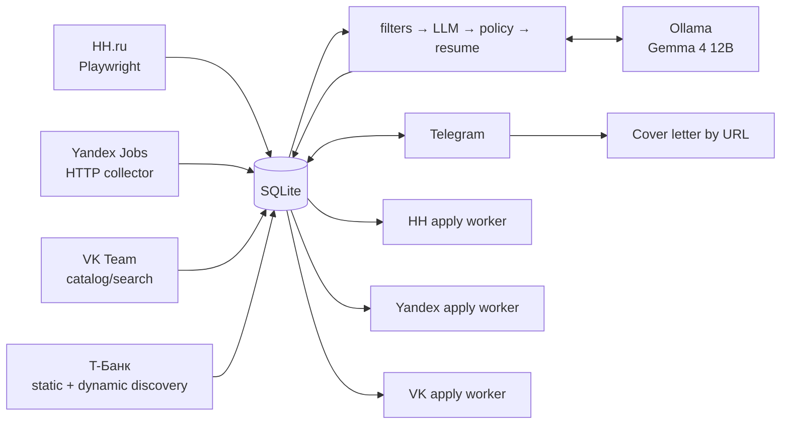
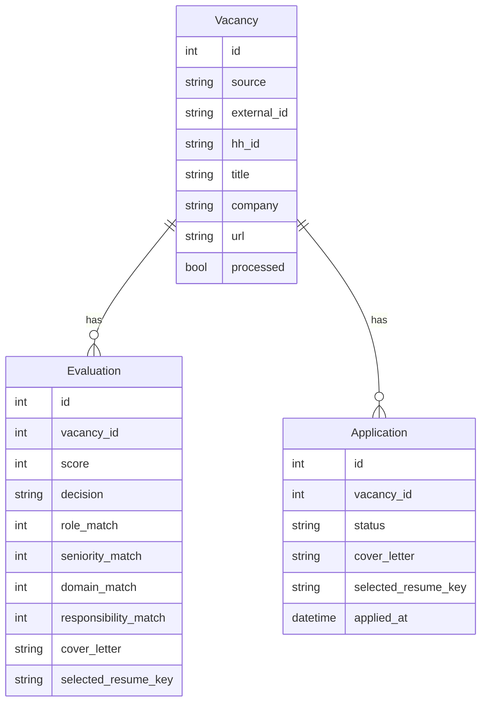

<div align="center">

# HH AGENT

**Автономный агент поиска, оценки и контролируемого отклика на вакансии**
Windows · Python 3.12 · Playwright · SQLite · Ollama · Telegram · GitHub Actions

[rudenko.one](https://rudenko.one/) · code snapshot `main @ ecfc658` · 2026-09-04

</div>

---

## 01 / Что это

HH Agent автоматизирует основной цикл поиска работы:

- собирает вакансии с **HH.ru**, **Yandex Jobs**, **VK Team** и **Т-Банка**;
- хранит вакансии, историю оценок и lifecycle отклика в **SQLite**;
- применяет hard filters до LLM;
- оценивает fit локальной моделью через **Ollama**;
- выбирает подходящее резюме и формирует vacancy-aware сопроводительное;
- показывает вакансии, очереди и runtime через **Telegram**;
- восстанавливает через `/new` unresolved `notified` и `manual_required` карточки;
- выполняет source-aware отклики на **HH**, **Yandex** и **VK**;
- умеет по присланной в Telegram ссылке подготовить отдельное copy-ready сопроводительное письмо.

> [!IMPORTANT]
> **`Application.status=approved` — финальное явное разрешение пользователя на отправку.** Для Yandex/VK финальный submit дополнительно требует operational switch `*_APPLY_LIVE=true`. Старое правило `approved + latest Evaluation=apply` больше не соответствует текущему `apply_dispatcher.py`.

> [!NOTE]
> **Т-Банк сейчас подключён как source/discovery.** Отдельного автоматического apply worker для него нет.

---

## 02 / Архитектура



Основная цепочка:

```text
hh_collect.py
    ↓
collect_careers.py       # Yandex + VK + Т-Банк
    ↓
process_vacancies.py
    ↓
apply_dispatcher.py      # HH + Yandex + VK
```

Ключевой принцип: **collectors, evaluation и site adapters разделены**. UI конкретного сайта не должен определять scoring, policy или содержание сопроводительного письма.

---

## 03 / Источники

| Source | Collection | Apply | Основная реализация |
|---|---|---|---|
| HH | Playwright, рекомендации + fallback search | автоматический после `approved` | `hh_collect.py`, `apply_worker.py` |
| Yandex | career HTTP collector | `approved` + `YANDEX_APPLY_LIVE=true` | `sources/yandex.py`, `yandex_apply_worker.py` |
| VK | catalog/search collector | `approved` + `VK_APPLY_LIVE=true` | `sources/vk.py`, `vk_apply_worker.py` |
| Т-Банк | static pagination + dynamic Playwright discovery | ручной контур | `sources/tbank.py` |

### Т-Банк

`TBankSource`:

- обходит IT и общий московский каталог;
- поддерживает vacancy paths `it` и `back-office`;
- сначала собирает ссылки статически по страницам;
- затем запускает dynamic discovery для lazy-loaded каталога;
- дедуплицирует карточки по UUID;
- отбрасывает закрытые и нерелевантные вакансии до LLM;
- делает bounded retry HTTP-запросов, включая `429`;
- падение одного карьерного source не останавливает остальные источники.

---

## 04 / Модель данных



`Vacancy` хранит нормализованный source/external identity. `Evaluation` — append-only история оценки и контекст для audit. `Application` — пользовательское решение и фактический operational lifecycle отклика.

После ручного `approved` история Evaluation остаётся важным audit-контекстом, но **не является вторым veto-gate для Yandex/VK**.

---

## 05 / Evaluation pipeline

Порядок обработки:

1. **Hard filters** — быстрые однозначные запреты до LLM.
2. **VacancyEvaluator** — structured response от Ollama.
3. **Evidence guard** — убирает ложные gaps при наличии подтверждённого опыта.
4. **Management policy** — детерминированная корректировка management cases.
5. **Resume matcher** — выбирает подходящее существующее резюме.
6. **Persistence** — сохраняет Evaluation и данные для Telegram/apply workflow.

```text
score =
    role_match           * 0.35 +
    seniority_match      * 0.20 +
    domain_match         * 0.15 +
    responsibility_match * 0.30
```

Production defaults:

| Параметр | Значение |
|---|---:|
| `LLM_MODEL` | `gemma4:12b` |
| `LLM_BASE_URL` | `http://localhost:11434` |
| `LLM_TIMEOUT` | `180` |
| `LLM_MAX_RETRIES` | `2` |
| `LLM_NUM_CTX` | `16384` |
| `TELEGRAM_MIN_SCORE` | `72` |

---

## 06 / Резюме и сопроводительные

Выбор резюме и генерация текста выполняются до adapter layer:

- используются только подтверждённые факты профиля;
- 2–3 релевантных факта связываются с задачами вакансии;
- запрещены placeholders и third-person формулировки;
- выбранный локальный PDF валидируется через `app/application_assets.py`;
- Yandex/VK загружают выбранный resume asset в форму;
- VK отдельно заполняет about/social/consent поля.

### Сопроводительное по ссылке в Telegram

Если прислать боту URL вакансии:

1. `app/vacancy_url.py` нормализует URL и определяет известный source;
2. если в БД уже есть готовое письмо, используется cached Evaluation;
3. HH/Yandex/VK получают описание source-aware способом;
4. другой публичный HTTP(S)-сайт читается generic fetch с защитой от localhost/private networks и bounded redirects;
5. Ollama генерирует письмо по локальному резюме и preferences;
6. Telegram отправляет metadata и затем отдельное copy-ready письмо.

---

## 07 / Apply architecture

### HH

```text
HH Agent - Apply
    ↓
background_apply.py
    ↓
apply_worker.py
```

HH worker получает только `approved` для `source=hh` и legacy `source IS NULL`.

### Yandex / VK

```text
apply_dispatcher.py
    ├─ yandex_apply_worker.py
    └─ vk_apply_worker.py
```

Текущий permission model:

```text
Application.status == approved
AND <SOURCE>_APPLY_LIVE == true
```

`approved` — решение пользователя. `*_APPLY_LIVE=false` — operational kill switch: worker не нажимает финальный submit.

### No blind retry

Если submit уже мог быть отправлен, но сайт не дал однозначного результата, Application переводится в `manual_required`. **Повторный автоматический submit запрещён**, пока человек не подтвердит, что первый отклик точно не ушёл.

---

## 08 / Application statuses

| Status | Значение |
|---|---|
| `notified` | карточка показана, решения нет |
| `approved` | пользователь разрешил отклик |
| `applying` | worker начал обработку |
| `waiting_captcha` | требуется ручное действие/CAPTCHA |
| `applied` | success подтверждён, заполнен `applied_at` |
| `manual_required` | автоматика безопасно остановилась и нужен человек |
| `apply_error` | техническая ошибка до подтверждённой отправки |
| `skipped` | пользователь пропустил вакансию |
| `company_blacklist` | компания отмечена для blacklist workflow |

`application_notifications.py` отправляет best-effort Telegram alert для `manual_required`: вакансия, компания, причина, `Application ID` и кнопка ручного открытия. `/new` повторно восстанавливает эти карточки.

---

## 09 / Windows Scheduler

| Task | Период | Entry point | Missed run |
|---|---|---|---|
| `HH Agent - Pipeline` | каждые 2 часа | `background_pipeline.py` | `StartWhenAvailable=True` |
| `HH Agent - Apply` | каждые 10 минут | `background_apply.py` | `StartWhenAvailable=True` |
| `HH Agent - Resume Raise` | каждые 2 часа | `background_resume_raise.py` | `StartWhenAvailable=True` |
| `HH Agent - Telegram` | при logon | `telegram_bot_entry.py` | restart + `StartWhenAvailable=True` |

Telegram task: `MultipleInstances=IgnoreNew`, restart через 1 минуту, `RestartCount=999`, без forced 72-hour stop.

`Pipeline`, `Apply` и `Resume Raise` используют общий **AgentLock**, поэтому конфликтующие browser jobs не работают параллельно.

### Снижение нагрузки на HH

HH collector сначала использует персональные рекомендации. Если они дали не меньше `HH_FALLBACK_MIN_NEW_FROM_RECOMMENDATIONS` новых вакансий (default 10), полный fallback search пропускается.

```text
HH_RECOMMENDATION_PAGES=3
HH_FALLBACK_MIN_NEW_FROM_RECOMMENDATIONS=10
HH_DELAY_BETWEEN_VACANCIES=7
HH_DELAY_BETWEEN_PAGES=10
HH_DELAY_BETWEEN_QUERIES=15
HH_COLLECT_WATCHDOG_SECONDS=120
```

Watchdog может завершить зависший Playwright/Chromium process tree; уже сохранённые вакансии остаются в SQLite и pipeline может продолжить обработку.

### Resume Raise reliability

`resume_raise_worker_v2.py` переживает временные DNS/network ошибки Playwright:

```text
HH_RESUME_RAISE_NAV_TIMEOUT_MS=30000
HH_RESUME_RAISE_NAV_RETRIES=3
HH_RESUME_RAISE_NAV_RETRY_DELAY_MS=15000
```

Retry покрывает DNS resolution failure, internet disconnect, network change, connection reset/timeout, proxy/tunnel errors и generic timeout. Неизвестные Playwright errors не маскируются.

---

## 10 / Установка и проверка Scheduler

```powershell
powershell -ExecutionPolicy Bypass -File C:\hh-agent\install_tasks.ps1
powershell -ExecutionPolicy Bypass -File C:\hh-agent\install_resume_raise_task.ps1
powershell -ExecutionPolicy Bypass -File C:\hh-agent\reinstall_telegram_task.ps1
```

Проверка:

```powershell
Get-ScheduledTask | Where-Object {$_.TaskName -like "HH Agent*"} |
    Select-Object TaskName, State,
        @{N='StartWhenAvailable';E={$_.Settings.StartWhenAvailable}}

Get-ScheduledTaskInfo -TaskName "HH Agent - Pipeline"
Get-ScheduledTaskInfo -TaskName "HH Agent - Resume Raise"
```

---

## 11 / Сессии, runtime и логи

Persistent profiles:

| Source | Path |
|---|---|
| HH | `C:\hh-agent\browser-profile` |
| Yandex | `C:\hh-agent\yandex-browser-profile` |
| VK | `C:\hh-agent\vk-browser-profile` |

Runtime:

```text
data/runtime/pipeline.json
data/runtime/apply.json
data/runtime/resume_raise.json
data/runtime/telegram.json
```

Основные логи:

```text
logs/pipeline_supervisor.log
logs/collector.log
logs/careers_collector.log
logs/processor.log
logs/apply_dispatcher.log
logs/apply_supervisor.log
logs/apply_worker_runtime.log
logs/yandex_apply_worker.log
logs/yandex_apply_worker_attention.log
logs/vk_apply_worker.log
logs/vk_apply_worker_attention.log
logs/telegram.log
logs/resume_raise_supervisor.log
logs/resume_raise_worker.log
```

Профили браузеров, `.env`, БД, runtime и логи не коммитятся.

---

## 12 / Telegram

Production entry point: `telegram_bot_entry.py`.

Runtime patches:

```text
telegram_bot_link_patch.py
telegram_bot_pending_patch.py
telegram_cover_letter_patch.py
telegram_cover_letter_output_patch.py
telegram_queue_stats_patch.py
```

| Command | Что делает |
|---|---|
| `/health` | healthcheck + runtime + очереди |
| `/status` | background states + approved queue by source |
| `/run` | запускает pipeline сейчас |
| `/new` | `manual_required` + unresolved `notified` + новые |
| `/stats` | статистика Application status |

`/health` и `/status` показывают approved breakdown по HH / Yandex / VK / Т-Банк.

`/new` использует bounded retry при `NetworkError`, `TimedOut`, `RetryAfter`, делает паузы между карточками и не прерывает пачку из-за одной ошибки доставки.

> [!CAUTION]
> Telegram bot сейчас работает в **public mode**. Access control/allow-list остаётся security backlog item.

---

## 13 / Ключевой Environment

```text
LLM_PROVIDER=ollama
LLM_MODEL=gemma4:12b
LLM_BASE_URL=http://localhost:11434
LLM_TIMEOUT=180
LLM_MAX_RETRIES=2
LLM_NUM_CTX=16384

TELEGRAM_MIN_SCORE=72
TELEGRAM_BOT_TOKEN=
TELEGRAM_CHAT_ID=

HH_RECOMMENDATION_PAGES=3
HH_FALLBACK_MIN_NEW_FROM_RECOMMENDATIONS=10
HH_DELAY_BETWEEN_VACANCIES=7
HH_DELAY_BETWEEN_PAGES=10
HH_DELAY_BETWEEN_QUERIES=15
HH_COLLECT_NAVIGATION_TIMEOUT_MS=30000
HH_COLLECT_WATCHDOG_SECONDS=120

HH_APPLY_HEADLESS=false
HH_APPLY_MAX_PER_RUN=10

HH_RESUME_RAISE_HEADLESS=true
HH_RESUME_RAISE_NAV_TIMEOUT_MS=30000
HH_RESUME_RAISE_NAV_RETRIES=3
HH_RESUME_RAISE_NAV_RETRY_DELAY_MS=15000

YANDEX_APPLY_LIVE=false
YANDEX_APPLY_APPLICATION_ID=

VK_APPLY_LIVE=false
VK_APPLY_APPLICATION_ID=
VK_APPLY_CAPTCHA_WAIT_SECONDS=300
VK_APPLY_SUCCESS_WAIT_SECONDS=10

APPLY_DISPATCH_HH=true
```

Не коммитить реальные tokens, credentials, browser profiles и персональные form values.

---

## 14 / Ручной запуск

```powershell
cd C:\hh-agent

# Pipeline
.\run_utf8.ps1 background_pipeline.py

# Telegram
.\.venv\Scripts\python.exe .\telegram_bot_entry.py

# Resume Raise
.\.venv\Scripts\python.exe .\resume_raise_worker_v2.py
```

Targeted Yandex/VK dry-run:

```powershell
$env:YANDEX_APPLY_APPLICATION_ID="<Application.id>"
$env:YANDEX_APPLY_LIVE="false"
.\run_utf8.ps1 yandex_apply_worker.py

$env:VK_APPLY_APPLICATION_ID="<Application.id>"
$env:VK_APPLY_LIVE="false"
.\run_utf8.ps1 vk_apply_worker.py
```

---

## 15 / Safety invariants

1. **Source separation** — worker не забирает очередь другого source.
2. **User approval is authoritative** — `approved` означает явное разрешение пользователя.
3. **External live switch** — Yandex/VK final submit дополнительно требует `*_APPLY_LIVE=true`.
4. **No blind retry after submit** — неоднозначный результат не приводит к повторной отправке.
5. **Local resume source of truth** — перед отправкой валидируется выбранный PDF.
6. **Evaluation history remains auditable** — историю не удалять.
7. **AgentLock обязателен** для конфликтующих background browser jobs.
8. **`/new` не переписывает решения** — он только восстанавливает unresolved карточки и добавляет новые.
9. **Т-Банк не считать automatic-apply source**, пока не появится отдельный adapter.
10. **Изменения в `main` — только через branch + PR.**

---

## 16 / Что накопилось после snapshot `79397da`

- добавлен **Т-Банк** как career source;
- discovery Т-Банка расширен до полного static + dynamic обхода `it` / `back-office`;
- добавлены regression tests Т-Банка;
- добавлен `app/vacancy_url.py`;
- Telegram научился генерировать сопроводительное по vacancy URL;
- `/health` и `/status` получили source breakdown очереди;
- добавлены Telegram alerts для `manual_required` и recovery через `/new`;
- Windows CI получил явный UTF-8 output;
- добавлен `LICENSE`;
- HH background cadence снижена до 2 часов, добавлены delays/fallback threshold;
- Resume Raise переведён на 2 часа и `StartWhenAvailable=True`;
- Resume Raise получил retry временных DNS/network failures;
- исправлена документация permission model Yandex/VK: `approved` — финальное разрешение пользователя.

---

## 17 / Структура репозитория

```text
app/
  db.py
  evaluator.py
  evaluation_policy.py
  hard_filters.py
  role_filter.py
  resume_matcher.py
  application_assets.py
  vacancy_url.py

sources/
  base.py
  yandex.py
  vk.py
  tbank.py

hh_collect.py
collect_careers.py
process_vacancies.py

apply_worker.py
apply_dispatcher.py
yandex_apply_worker.py
vk_apply_worker.py
application_notifications.py

background_common.py
background_pipeline.py
background_apply.py
background_resume_raise.py
resume_raise_worker_v2.py

telegram_bot.py
telegram_bot_entry.py
telegram_bot_link_patch.py
telegram_bot_pending_patch.py
telegram_cover_letter_patch.py
telegram_cover_letter_output_patch.py
telegram_queue_stats_patch.py

.github/workflows/ci.yml
LICENSE
tests/

doc/
  HH_Agent_System_Documentation.md
  HH_Agent_System_Documentation.pdf
```

---

## 18 / Технический долг

- `telegram_bot.py` всё ещё расширяется runtime patch-модулями; их стоит постепенно консолидировать.
- Telegram public mode требует access control/allow-list.
- Для Т-Банка нет отдельного apply adapter.
- `role_filter.py`: короткие substring markers стоит дополнительно покрыть word-boundary regression tests.
- Production CD на Windows self-hosted runner не реализован; сейчас есть Windows CI.
- При архитектурных изменениях README и `doc/HH_Agent_System_Documentation.*` должны обновляться одним PR.

---

## 19 / Engineering workflow

Перед merge изменений в collectors / evaluator / apply / Telegram:

- создать отдельную branch; **не коммитить напрямую в `main`**;
- читать актуальный target-файл перед изменением;
- проверить diff whitespace, syntax/imports и tests;
- проверить source routing и permission model;
- для live submit использовать targeted `Application ID`;
- после live test проверить `status`, `applied_at` и logs;
- не делать повторный submit при неоднозначном результате;
- при изменении архитектуры обновить README и system documentation;
- открыть PR, пройти checks/review и только потом merge.

---

## 20 / Документация

Полная системная документация:

- [`doc/HH_Agent_System_Documentation.md`](doc/HH_Agent_System_Documentation.md)
- [`doc/HH_Agent_System_Documentation.pdf`](doc/HH_Agent_System_Documentation.pdf)

Лицензия: [`LICENSE`](LICENSE).

---

<div align="center">

**HH AGENT / rudenko.one**

Документация актуализирована для code snapshot `main @ ecfc658` · 2026-09-04

</div>
