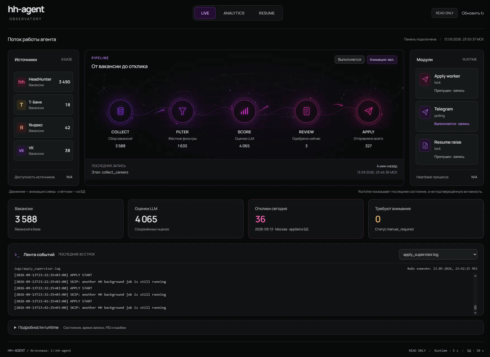

# HH AGENT

**Windows-first агент поиска работы: discovery → filtering → LLM/policy → OLD/CLEAN routing → canonical cover letter → apply → screening copilot**

Windows · Python 3.12 · Playwright · SQLite · Ollama · Telegram · FastAPI · Grafana Cloud · Alloy · GitHub Actions · Octopus Deploy

[rudenko.one](https://rudenko.one/)

---

 

HH Agent Observatory — локальная read-only панель.

## Что это

HH Agent — локальный Windows-first агент, который автоматизирует большую часть цикла поиска работы: собирает вакансии, фильтрует их, оценивает локальной LLM, маршрутизирует по политике OLD/CLEAN, готовит каноническое сопроводительное, отправляет отклики через source-specific workers и помогает проходить screening.

Система намеренно разделяет discovery, evaluation, business policy, user interaction и site automation. Решение о том, что вакансия подходит, не должно зависеть от DOM конкретного job board, а факт успешного отклика не смешивается с фактом прикрепления сопроводительного.

| Контур | Что делает |
|---|---|
| **Discovery** | HH.ru OLD/CLEAN, Yandex Jobs, VK Team, Т-Банк |
| **Filtering** | hard filters, LLM-апелляция спорных reject, role/domain policy |
| **Scoring** | локальный Ollama, structured evaluation, evidence guard |
| **HH routing** | CLEAN — селективный review-flow; OLD — отдельный policy-gated auto-apply stream |
| **Resume** | выбор профиля/резюме и single-resume experiment |
| **Cover letter** | canonical vacancy-bound artifact, immutable decision snapshot, native HH attachment/recovery |
| **Apply** | HH, Yandex и VK через отдельные adapters/workers |
| **Telegram** | рекомендации, health/status, recovery, ручные действия |
| **Sber screening** | отдельный GigaRecruiter copilot через Telegram Web |
| **Resume Raise** | supervisor с расписанием по доступности HH |
| **Observatory** | read-only LIVE / ANALYTICS / RESUME dashboard |
| **Targeted Hunt** | поиск точки входа и контакта в компании |
| **CI/CD** | PR-first GitHub Actions → Octopus Deploy → production PC |

> [!IMPORTANT]
> CLEAN и OLD — разные HH-контуры. CLEAN остаётся селективным и ориентированным на review пользователя. OLD автоматически допускает отклик только после собственных score/semantic gates и готового canonical cover letter; gate повторно проверяется непосредственно перед submit.

> [!NOTE]
> Т-Банк сейчас используется как source/discovery. Отдельного automatic apply worker для него нет.

---

## Архитектура

~~~mermaid
C4Container
    title HH Agent — C4 Container Diagram

    Person(user, "Пользователь", "Проверяет рекомендации, подтверждает действия и screening-ответы")

    System_Ext(hho, "HH.ru OLD", "Отдельный HH-аккаунт и source/apply контур")
    System_Ext(hhc, "HH.ru CLEAN", "Селективный HH-аккаунт с review-flow")
    System_Ext(ya, "Yandex Jobs", "Источник вакансий и apply target")
    System_Ext(vk, "VK Team", "Источник вакансий и apply target")
    System_Ext(tb, "Т-Банк", "Источник вакансий")
    System_Ext(ollama, "Ollama", "Локальный LLM runtime")
    System_Ext(giga, "GigaRecruiter / Telegram Web", "Канал Sber screening")

    Container_Boundary(agent, "HH Agent") {
        Container(discovery, "Discovery", "Python + Playwright", "Собирает вакансии из HH.ru, Yandex Jobs, VK Team и Т-Банк")
        ContainerDb(db, "State DB", "SQLite", "Вакансии, evaluations, applications, approvals и screening state")
        Container(eval, "Evaluation", "Python", "hard filters → appeal → LLM → policy → resume")
        Container(route, "Routing", "Python policy", "CLEAN review / OLD gated auto-flow")

        Container(tg, "Telegram bot", "Python", "Карточки, подтверждения, status и manual actions")
        Container(hha, "HH apply workers", "Python + Playwright", "OLD/CLEAN submit и native cover-letter flows")
        Container(yaa, "Yandex apply", "Python + Playwright", "Source-specific apply worker")
        Container(vka, "VK apply", "Python + Playwright", "Source-specific apply worker")
        Container(sber, "Sber screening copilot", "Python + Playwright/CDP", "Grounded ответы с обязательным подтверждением пользователя")

        ContainerDb(runtime, "Runtime state", "data/runtime/*.json", "Состояние фоновых процессов")
        ContainerDb(logs, "Logs", "logs/*.log", "Runtime и worker logs")
        Container(obs, "HH Agent Observatory", "FastAPI", "Read-only LIVE / ANALYTICS / RESUME dashboard")
    }

    Rel(hho, discovery, "Вакансии")
    Rel(hhc, discovery, "Вакансии")
    Rel(ya, discovery, "Вакансии")
    Rel(vk, discovery, "Вакансии")
    Rel(tb, discovery, "Вакансии")
    Rel(discovery, db, "Сохраняет")

    Rel(db, eval, "Pending vacancies")
    BiRel(eval, ollama, "Structured evaluation / appeal")
    Rel(eval, route, "Evaluation result")
    Rel(route, db, "Routing decision")

    BiRel(user, tg, "Review / approve / manual action")
    BiRel(tg, db, "Карточки и решения")

    Rel(db, hha, "HH apply queue")
    Rel(hha, hho, "Submit / cover recovery")
    Rel(hha, hhc, "Submit / cover recovery")
    Rel(db, yaa, "Yandex apply queue")
    Rel(yaa, ya, "Submit")
    Rel(db, vka, "VK apply queue")
    Rel(vka, vk, "Submit")

    BiRel(giga, sber, "Screening messages / confirmed replies")
    BiRel(sber, tg, "Draft / approve / custom reply")

    Rel(db, obs, "read only")
    Rel(runtime, obs, "read only")
    Rel(logs, obs, "read only")
    Rel(user, obs, "Смотрит состояние")

    UpdateLayoutConfig($c4ShapeInRow="4", $c4BoundaryInRow="1")
~~~

Фоновый pipeline:

~~~text
check_hh_session
    ↓
hh_collect_optimized.py
    ↓
collect_careers.py
    ↓
process_vacancies.py
~~~

Отклики работают отдельно:

~~~text
background_apply.py
    ↓
apply_dispatcher.py
    ├─ HH OLD/CLEAN → apply_worker.py
    ├─ Yandex       → yandex_apply_worker.py
    └─ VK           → vk_apply_worker.py
~~~

Pipeline и apply больше не обязаны глобально блокировать друг друга. HH-операции сериализуются по конкретному аккаунту через profile lock: OLD apply может работать одновременно с CLEAN collector и наоборот.

---

## Evaluation и routing

Основной evaluation pipeline:

1. hard filters;
2. LLM-апелляция appealable hard reject;
3. structured evaluation через Ollama;
4. evidence guard;
5. management/domain policy;
6. resume matcher;
7. сохранение Evaluation и данных для дальнейшего routing/apply.

Базовый score:

~~~text
role_match           * 0.35 +
seniority_match      * 0.20 +
domain_match         * 0.15 +
responsibility_match * 0.30
~~~

При занятом GPU или временной ошибке Ollama scoring/appeal откладывается: вакансия остаётся pending и будет обработана следующим проходом. Длинный здоровый batch не убивается общим wall-clock timeout; таймауты остаются на уровне отдельных внешних операций.

### CLEAN

CLEAN остаётся селективным контуром. Перед routing текущая policy может быть детерминированно пересчитана поверх уже сохранённого LLM extraction, чтобы изменения preferences/gates не оставляли старые ложные SKIP. Такой refresh не требует повторного LLM-вызова.

### OLD

OLD использует широкий discovery, но не является full-coverage каналом. Текущий auto-flow:

~~~text
vacancy
  → legacy score
  → score >= 80
  → semantic shadow
  → current eligibility
  → canonical cover letter
  → approved
  → gate re-check
  → conservative HH submit
~~~

SKIP/HOLD не допускаются к OLD auto-apply. При неоднозначном или ошибочном submit application не уходит в бесконечный retry: она переводится в существующий manual_required flow.

---

## Canonical cover letters

Сопроводительное — отдельный артефакт, а не строка, которую можно заново сгенерировать в момент submit.

Ключевые свойства:

- один canonical artifact привязан к vacancy/account/profile-version/vacancy-hash/prompt-version;
- финальный текст vacancy-bound и проверяется до approval/apply;
- decision snapshot хранит именно тот final_text, который был подготовлен для отправки;
- обычный Telegram/HH chat message не считается прикреплённым сопроводительным;
- факт Application submit и факт cover-letter attachment подтверждаются отдельно;
- blind retry после потенциально успешного submit запрещён.

Для HH используются реальные native paths:

1. письмо уходит в первичном response request, когда форма это поддерживает;
2. если HH уже показывает письмо в исходной карточке «Отклик на вакансию», attachment считается confirmed;
3. если после отклика появляется штатный post-apply editor, выполняется один native submit и повторная проверка;
4. в Chatik используется отдельное действие «Добавить сопроводительное» → dedicated editor → «Сохранить»;
5. исходная response card после Save перечитывается как source of truth.

Delayed post-apply UI также учитывается: worker коротко ждёт появление доказательства отправленного отклика, чтобы не перепутать асинхронно появившийся post-apply flow с отсутствующей textarea.

---

## Два HH-аккаунта: OLD и CLEAN

Браузерные сессии хранятся раздельно:

- ⚪ **OLD** → browser-profile/
- 🟢 **CLEAN** → browser-profile-clean/

Оба профиля сейчас используют Playwright persistent profile и работают headless в background path. Profile/cookies/account metadata локальны и не коммитятся.

Проверить оба аккаунта:

~~~powershell
.\.venv\Scripts\python.exe .\check_hh_session.py --account all
~~~

Перелогинить конкретный аккаунт:

~~~powershell
.\.venv\Scripts\python.exe .\hh_login.py --account old
.\.venv\Scripts\python.exe .\hh_login.py --account clean
~~~

Принудительный выбор поддерживается через HH_ACTIVE_ACCOUNT=old|clean.

### OLD throttle и CAPTCHA

OLD auto-apply имеет persistent rate state:

- fast ceiling: до **29 откликов/час**;
- randomized inter-apply delay: **120–180 секунд**;
- daily cap: **180**;
- после подтверждённого CAPTCHA/challenge — persistent pause;
- после ручного resume действует safe mode: **12/час**, **180–300 секунд**, до **24 часов**;
- CAPTCHA не обходится автоматически.

Для read-only collector одиночный transient redirect на /account/captcha перепроверяется немедленным retry. Только повторившийся anti-bot signal переводит аккаунт в persistent pause.

После ручного прохождения CAPTCHA:

~~~text
/hh_resume old
~~~

---

## Telegram

Production entry point: telegram_bot_entry.py.

| Команда | Что делает |
|---|---|
| **/health** | healthcheck + runtime + очереди |
| **/status** | background jobs + apply queues |
| **/run** | запускает pipeline сейчас |
| **/new** | CLEAN cards + OLD manual_required; обычные OLD auto-candidates не вытаскиваются в review |
| **/new clean** | явный CLEAN view |
| **/new old** | полный OLD card view |
| **/stats** | статистика Application status |
| **/hh_resume old** | снимает OLD CAPTCHA pause после ручного прохождения проверки |
| **/sber_arm** | fallback для явного запуска Sber screening context |

Доставка /new выполняется в background task и не блокирует event loop бота.

> [!CAUTION]
> Telegram bot сейчас работает в public mode. Access control / allow-list остаётся security backlog item.

---

## Sber / GigaRecruiter screening copilot

Screening вынесен в отдельный мини-сервис и не смешан с обычным HH apply worker.

Transport — авторизованный Telegram Web profile, к которому Playwright подключается через local CDP. Copilot читает только чат GigaRecruiter, связывает вопросы с конкретной vacancy/session и готовит grounded ответ.

Текущий flow:

- новая session автоматически стартует по явному приветствию «Получил Ваш отклик на позицию X», если vacancy context можно разрешить;
- поддерживается resumed flow «Давайте продолжим общение по вакансии X. Мы остановились на этом месте:»;
- matching названий нормализует пробелы вокруг скобок и варианты тире;
- ответ предпочитает bounded grounded formulation при наличии подтверждённого смежного опыта;
- общие вопросы о мотивации поиска работы могут отвечаться из подтверждённого профессионального опыта и контекста вакансии, без выдумывания личных обстоятельств;
- явные личные причины увольнения, пауз или смены работы требуют подтверждённого факта от пользователя;
- неизвестные frameworks, цифры, проценты и hands-on детали не выдумываются;
- отправка выполняется только после подтверждения пользователя;
- кнопка **✏️ Свой ответ** открывает Telegram ForceReply, привязанный к конкретному turn;
- /sber_answer остаётся fallback;
- terminal interview message завершает session без LLM-вызова;
- rating и vacancy-list после terminal не создают новые pending turns;
- stale-question guard не позволяет отправить ответ на уже устаревший вопрос.

---

## HH Agent Observatory

dashboard/ — локальная read-only панель. Она не управляет workers и не меняет business state.

В панели есть:

- **LIVE** — схема COLLECT → FILTER → SCORE → REVIEW → APPLY, sources, runtime и последние события;
- **ANALYTICS** — отклики по дням, распределение LLM score и накопленные показатели;
- **RESUME** — метрики single-resume experiment;
- tail выбранных логов и runtime pipeline / apply / Telegram / resume raise.

Открыть: http://127.0.0.1:8765

Подробности: [dashboard/README.md](dashboard/README.md).

Для внешней observability локальные logs/*.log отправляются через Grafana Alloy в Grafana Cloud Loki. Свежие события помечаются service="hh-agent" и stream_version="v2", а timestamp в RFC3339 берётся из самих строк лога, чтобы исторический backfill не искажал временные графики.

Готовый импортируемый dashboard: [doc/grafana/hh-agent-observatory-v2.json](doc/grafana/hh-agent-observatory-v2.json). Настройка и LogQL-примеры: [doc/grafana/README.md](doc/grafana/README.md).

---

## Windows Scheduler и concurrency

| Task | Период | Entry point |
|---|---|---|
| **HH Agent - Pipeline** | каждые 2 часа | background_pipeline.py |
| **HH Agent - Apply** | каждую минуту | background_apply.py |
| **HH Agent - Resume Raise** | проверка каждые 5 минут | background_resume_raise.py |
| **HH Agent - Telegram** | при logon + restart policy | telegram_bot_entry.py |
| **HH Agent - Dashboard** | при logon + restart policy | dashboard |
| **Sber screening** | отдельный Scheduled Task / poller | Telegram Web screening worker |

Lock model:

- Pipeline сохраняет global AgentLock как singleton/deploy coordination;
- каждый HH account worker использует собственный HHProfileLock;
- OLD и CLEAN могут выполнять browser work параллельно, если это разные profiles;
- внутри одного HH profile операции взаимоисключающие;
- deployment резервирует global lock и HH profile locks перед обновлением production.

---

## CI/CD и production deployment

Все изменения в main проходят через branch + PR. После merge production checkout на HH-Agent-PC обновляется автоматически через GitHub Actions и Octopus Deploy.

~~~mermaid
flowchart LR
    DEV[feature branch] --> PR[pull request]
    PR --> CI1[CI]
    CI1 --> MERGE[merge to main]
    MERGE --> CI2[CI on main]
    CI2 --> CD[CD]
    CD --> OCT[Octopus Deploy]
    OCT --> PC[HH-Agent-PC]
    PC --> SCRIPT[deploy/octopus_deploy.ps1]
    SCRIPT --> REPO[C:\hh-agent]
~~~

Фактическая цепочка:

~~~text
branch → PR → CI → merge → CI main → CD → Octopus → HH-Agent-PC → C:\hh-agent
~~~

Deployment-логика живёт в [deploy/octopus_deploy.ps1](deploy/octopus_deploy.ps1). Octopus хранит только небольшой launcher, который запускает versioned script на target machine.

### Защита production checkout

- deployment ждёт освобождения global/profile locks перед Git update;
- затем удерживает нужные locks на время Git update и sanity checks;
- tracked локальные изменения блокируют deployment и никогда не сбрасываются автоматически;
- harmless untracked-файлы допускаются и остаются на месте;
- чистый checkout может автоматически вернуться с feature branch на main;
- update разрешён только fast-forward к origin/main;
- после обновления выполняются Python sanity checks;
- Telegram перезапускается только при релевантных изменениях;
- при ошибке post-update validation repository возвращается к предыдущему SHA.

CI на Windows / Python 3.12 проверяет whitespace, компиляцию Python, синтаксис deployment PowerShell и core unit tests.

> [!NOTE]
> GitHub CD подтверждает создание deployment в Octopus. Финальный target-side результат проверяется в Octopus отдельно.

Проверка deployment на машине:

~~~powershell
cd C:\hh-agent
& "C:\Program Files\Git\cmd\git.exe" rev-parse HEAD
& "C:\Program Files\Git\cmd\git.exe" rev-parse origin/main
& "C:\Program Files\Git\cmd\git.exe" status --short
~~~

HEAD и origin/main должны совпадать. Подробности: [doc/ci_cd.md](doc/ci_cd.md).

---

## Runtime и логи

Runtime:

~~~text
data/runtime/pipeline.json
data/runtime/apply.json
data/runtime/resume_raise.json
data/runtime/telegram.json
~~~

Основные логи:

~~~text
logs/pipeline_supervisor.log
logs/collector.log
logs/careers_collector.log
logs/processor.log
logs/apply_dispatcher.log
logs/apply_supervisor.log
logs/telegram.log
logs/resume_raise_supervisor.log
logs/resume_raise_worker.log
~~~

Профили браузеров, .env, БД, runtime и логи не коммитятся.

### Grafana Cloud / Loki

На production PC Grafana Alloy читает C:\hh-agent\logs\*.log и отправляет новые строки в Grafana Cloud Loki. Новые .log подхватываются автоматически. Рабочий Alloy config хранится только на машине, потому что содержит Grafana Cloud credentials и не должен попадать в Git.

Проверка локального collector:

~~~powershell
Get-Service Alloy
Invoke-WebRequest http://127.0.0.1:12345/-/ready -UseBasicParsing |
    Select-Object StatusCode, Content
~~~

Ожидается Running и HTTP 200.

---

## Safety invariants

1. **Source separation** — worker не забирает очередь другого source.
2. **CLEAN review is authoritative** — селективный CLEAN-flow не должен самовольно обходить пользовательское решение.
3. **OLD auto-apply is policy-gated** — score, semantic relevance, current eligibility и canonical letter обязательны; gate перепроверяется перед submit.
4. **Application и cover letter — разные факты** — successful apply не превращается в apply_error только из-за проблемы attachment.
5. **Native cover-letter proof only** — обычный chat message не является доказательством прикрепления письма.
6. **No blind retry after submit** — неоднозначный результат не приводит к повторной отправке.
7. **External live switch** — Yandex/VK final submit требует *_APPLY_LIVE=true.
8. **Evaluation history remains auditable** — история оценок сохраняется.
9. **Per-profile locking** — HH OLD/CLEAN синхронизируются внутри своего browser profile; deploy координируется глобально.
10. **/new не ломает OLD auto-queue** — default view показывает CLEAN и OLD manual_required, не переводя обычные OLD candidates в notified.
11. **Sber screening не auto-sends** — любой ответ проходит approve/custom-reply path и stale-turn guard.
12. **Т-Банк не является automatic-apply source**, пока нет отдельного adapter.
13. **Изменения в main — только через branch + PR.**
14. **Production update — fast-forward only**; tracked локальные изменения не уничтожаются деплоем.

---

## Структура репозитория

~~~text
.github/workflows/       # CI + CD
deploy/                  # Octopus deployment logic
app/                     # evaluation, DB, policies, resume, Targeted Hunt
sources/                 # Yandex / VK / T-Bank collectors
dashboard/               # FastAPI + local Observatory UI
tests/                   # regression tests
doc/                     # system and feature documentation
  grafana/                # Grafana Cloud docs + dashboard JSON

hh_collect_optimized.py
collect_careers.py
process_vacancies.py
apply_dispatcher.py
apply_worker.py
yandex_apply_worker.py
vk_apply_worker.py
background_pipeline.py
background_apply.py
background_resume_raise.py
telegram_bot_entry.py
resume_raise_worker_v2.py
run_hidden.vbs

deploy/octopus_deploy.ps1
deploy/agent_lock_holder.py
~~~

---

## Документация

- [CI/CD and production deployment](doc/ci_cd.md)
- [HH Agent Observatory](dashboard/README.md)
- [Grafana Cloud observability](doc/grafana/README.md)
- [Grafana dashboard JSON](doc/grafana/hh-agent-observatory-v2.json)
- [Single-resume experiment](doc/single_resume_experiment.md)
- [Targeted Hunt](doc/targeted_hunt.md)
- [HH apply success detection](doc/hh_apply_success_detection.md)
- [System documentation](doc/HH_Agent_System_Documentation.md)
- [System documentation PDF](doc/HH_Agent_System_Documentation.pdf)
- [License](LICENSE)

> [!NOTE]
> System documentation содержит полезную устойчивую архитектуру, но для текущего runtime behavior источником истины являются актуальный main, production state и свежие логи.

---

**HH AGENT / rudenko.one**

Local-first automation with explicit controls, source-specific workers and auditable decisions.

