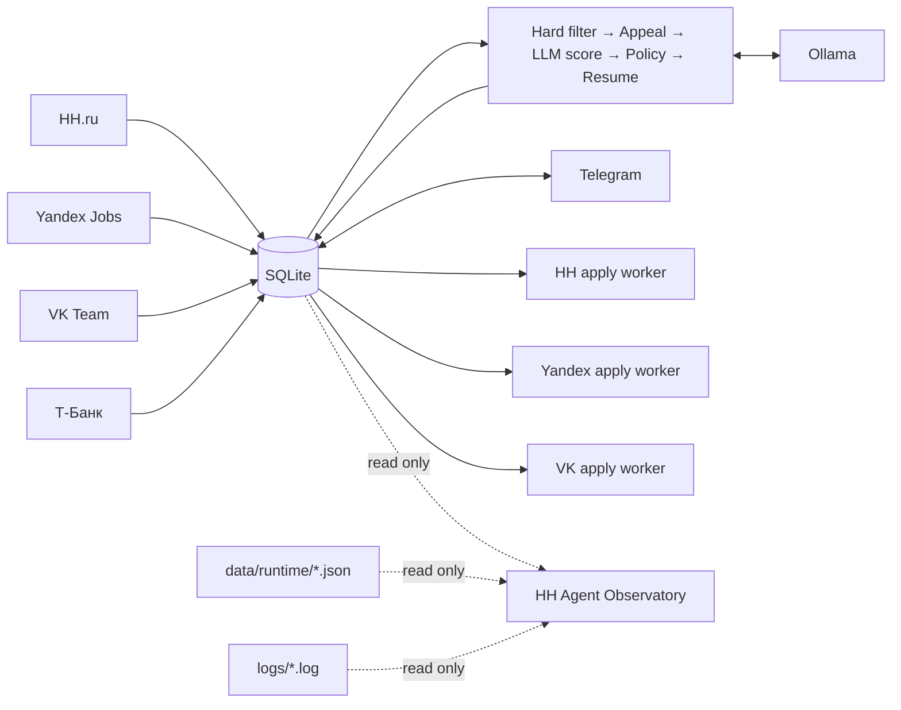

# HH Agent — системная документация

**Актуально:** 14 сентября 2026

**Снимок кода:** `main @ 3d31520`

**Платформа:** Windows · Python 3.12 · Playwright · SQLite · Ollama · Telegram · FastAPI · GitHub Actions · Octopus Deploy

**Назначение документа:** архитектура, контуры исполнения, безопасность, эксплуатация и доставка HH Agent в production.

> PDF рядом с этим файлом — оформленная версия для чтения и презентации. Markdown остаётся поддерживаемым источником содержания.

---

## 1. Система в одном абзаце

HH Agent — локальный Windows-first агент поиска работы. Он собирает вакансии из нескольких источников, отбрасывает очевидно неподходящие, даёт спорным hard-filter reject право на LLM-апелляцию, выполняет структурированную LLM-оценку, подбирает резюме, готовит vacancy-aware сопроводительное письмо, показывает рекомендации в Telegram и отправляет только те отклики, которые явно одобрил пользователь. Сбор, оценка, решение пользователя и site-specific apply adapters разведены по разным контурам, чтобы изменение интерфейса сайта не могло незаметно поменять правила оценки или разрешения на отправку.

### Ключевые свойства

| Контур | Текущее поведение |
|---|---|
| Discovery | HH.ru, Yandex Jobs, VK Team, Т-Банк |
| Filtering | hard filters + LLM appeal для спорных reject + role/domain policy |
| Scoring | локальный Ollama, structured output, evidence guard, management policy |
| Resume | выбор профиля/резюме, single-resume experiment и телеметрия |
| Cover letter | генерируется под конкретную вакансию и использует только подтверждённые факты |
| Approval | каждый отклик требует явного пользовательского `approved` |
| Apply | отдельные workers для HH, Yandex и VK; Т-Банк — discovery only |
| Telegram | рекомендации, health/status, ручной запуск, recovery и URL→cover-letter flow |
| Resume Raise | smart supervisor, который открывает HH только к ожидаемому времени бесплатного подъёма |
| Observatory | локальная read-only панель LIVE / ANALYTICS / RESUME |
| Targeted Hunt | поиск точки входа и релевантного контакта в компании |
| CI/CD | branch → PR → CI → main → CD → Octopus → production PC |

---

## 2. Высокоуровневая архитектура



### Фоновый pipeline

```text
check_hh_session
    ↓
hh_collect_optimized.py
    ↓
collect_careers.py
    ↓
process_vacancies.py
```

Apply живёт отдельно от pipeline:

```text
background_apply.py
    ↓
apply_dispatcher.py
    ├─ HH      → apply_worker.py
    ├─ Yandex  → yandex_apply_worker.py
    └─ VK      → vk_apply_worker.py
```

Это разделение принципиально. Pipeline может собирать и оценивать вакансии без запуска откликов. Apply supervisor читает только явно разрешённую очередь. Observatory ничего не меняет и подключён к данным только на чтение.

---

## 3. Модель данных и жизненный цикл

### Vacancy

Хранит нормализованную вакансию и идентичность источника. Каноническая идентичность — `source + external_id`; `hh_id` сохранён для legacy-совместимости HH.

### Evaluation

История оценок сохраняется для аудита. В ней находятся итоговый score и decision, role/seniority/domain/responsibility fit, gaps и red flags, рекомендация, сгенерированное сопроводительное, выбранный resume key и метаданные matching.

### Application

Хранит пользовательское решение и operational lifecycle отклика.

| Статус | Смысл |
|---|---|
| `notified` | карточка показана в Telegram, решения ещё нет |
| `approved` | пользователь явно разрешил отклик |
| `applying` | worker начал обработку |
| `waiting_captcha` | нужен ручной CAPTCHA / сайт ждёт человека |
| `applied` | успех подтверждён, заполнен `applied_at` |
| `manual_required` | автоматика безопасно остановилась и ждёт человека |
| `apply_error` | техническая ошибка до подтверждённой отправки |
| `skipped` | пользователь пропустил вакансию |
| `company_blacklist` | компания отправлена в blacklist flow |

Основной safety-принцип: факт `approved` сильнее предыдущего LLM decision и означает явное пользовательское разрешение. Evaluation после этого остаётся контекстом и историей, а не вторым скрытым veto-gate.

---

## 4. Discovery: от источника до SQLite

### 4.1 HH.ru

Production collector запускается через `hh_collect_optimized.py`. Он патчит базовый `hh_collect.py`, но сохраняет его browser/session logic и watchdog.

Текущая стратегия:

- persistent Playwright profile `browser-profile`;
- проверка HH-сессии перед сбором;
- персональные рекомендации обрабатываются первыми;
- fallback target-role search запускается только если рекомендаций недостаточно;
- target-role queries приоритизируются;
- на fallback SERP очевидно нецелевые title отсеиваются до открытия карточки;
- уже сохранённые вакансии остаются в SQLite даже при последующем зависании browser process;
- child collector контролируется watchdog, который способен остановить зависшее дерево процессов.

Базовые значения:

```text
HH_RECOMMENDATION_PAGES=3
HH_FALLBACK_MIN_NEW_FROM_RECOMMENDATIONS=10
HH_DELAY_BETWEEN_VACANCIES=7
HH_COLLECT_NAVIGATION_TIMEOUT_MS=30000
HH_COLLECT_WATCHDOG_SECONDS=120
```

`hh_collect_optimized.py` дополнительно уменьшает старые default delays между страницами и запросами до 8 и 10 секунд соответственно, если они не переопределены environment variables.

Если HH-сессия протухла, pipeline не подменяет персональный сбор обычным поиском: HH collection пропускается, пользователь получает предупреждение, а корпоративные источники и дальнейшая обработка продолжаются.

### 4.2 Yandex Jobs

`sources/yandex.py` вызывается через `collect_careers.py`. Источник изолирован от других career collectors. Apply выполняет `yandex_apply_worker.py` только для `approved` и только при `YANDEX_APPLY_LIVE=true`.

### 4.3 VK Team

`sources/vk.py` собирает вакансии VK Team. Worker умеет заполнять contact/about/social fields, загружать выбранное резюме, обрабатывать consent, ограниченно ждать ручную CAPTCHA и распознавать успешную отправку, ошибку либо structural form change.

### 4.4 Т-Банк

`sources/tbank.py` — discovery-only source. Он сочетает static pagination и dynamic Playwright discovery, умеет обходить lazy-loaded catalog, дедуплицирует вакансии по UUID, отбрасывает inactive/closed и применяет management/product/project title policy. Transient HTTP errors ретраятся, `429` обрабатывается bounded backoff.

Т-Банк намеренно не маршрутизируется в automatic apply: отдельного `tbank_apply_worker.py` сейчас нет.

### 4.5 Fault isolation career-источников

`collect_careers.py` запускает Yandex, VK и Т-Банк независимо. Ошибка одного источника не должна останавливать остальные; pipeline продолжает работу с теми данными, которые удалось получить.

---

## 5. Evaluation pipeline

Текущий порядок обработки:

```text
Hard filters
    ↓
LLM appeal для appealable reject
    ↓
Structured evaluation (Ollama)
    ↓
Evidence guard
    ↓
Deterministic management policy
    ↓
Resume matcher / selector
    ↓
Persistence + Telegram eligibility
```

### 5.1 Hard filters

Hard filters нужны для дешёвого отсечения очевидно нецелевых вакансий. Политика расширена так, чтобы CTO/CIO/IT Director/Head/руководители департаментов, направлений и смежные senior technology leadership titles не выпадали только из-за непривычной формулировки.

### 5.2 LLM-апелляция hard reject

Не каждый reject окончателен. Для appealable cases `HardFilterAppealReviewer` просит LLM определить, не является ли hard reject false negative.

- verdict: `confirm_reject` или `override_reject`;
- confidence: `0.0..1.0`;
- default threshold для override: `0.75`;
- максимум 2 попытки structured response;
- prompt отдельно требует учитывать нестандартные русские/английские titles, C-level, Director/Head и реальные обязанности, не придумывая кандидату опыт.

Исторические reject могут переоцениваться отдельным backfill flow.

### 5.3 Structured scoring

Базовая формула:

```text
role_match           * 0.35 +
seniority_match      * 0.20 +
domain_match         * 0.15 +
responsibility_match * 0.30
```

Evaluation идёт через локальный Ollama и structured schema. Evidence guard проверяет, что вывод опирается на вакансию и подтверждённые факты профиля. Management policy затем применяет детерминированные карьерные правила поверх LLM результата.

### 5.4 LLM resilience

Если GPU занят или Ollama временно недоступен, scoring/appeal не превращаются в ложный reject. Вакансия остаётся pending и может быть обработана следующим проходом. Длинный здоровый `process_vacancies.py` не ограничен общим wall-clock timeout; timeouts остаются на уровне конкретных внешних операций.

---

## 6. Резюме и сопроводительные

Resume selection происходит до site adapter. Выбранный локальный PDF валидируется через `app/application_assets.py` и рассматривается как submission source of truth.

Сопроводительное письмо:

- создаётся под конкретную вакансию;
- связывает только релевантные подтверждённые факты профиля с требованиями роли;
- не содержит placeholders;
- не выдумывает опыт, стек или достижения;
- сохраняется в Evaluation/Application context и затем используется worker'ом.

### Vacancy URL → cover letter через Telegram

Пользователь может прислать ссылку на вакансию. Flow канонизирует URL, определяет HH/Yandex/VK, по возможности использует уже сохранённое Evaluation letter, иначе получает vacancy content и генерирует новое письмо через локальное резюме, preferences и Ollama. Для неизвестных public HTTP(S) сайтов generic fetch path ограничивает localhost/private/service networks, нестандартные порты и неконтролируемые redirects.

---

## 7. Permission model и маршрутизация откликов

### User approval — authoritative

`Application.status == approved` означает: пользователь уже явно разрешил отправку. Это единственный business approval gate после того, как решение принято человеком.

### Дополнительные operational switches

```text
YANDEX_APPLY_LIVE=true
VK_APPLY_LIVE=true
```

Эти switches — технические kill switches внешней отправки. При `false` очередь можно видеть и диагностировать, но final submit не должен происходить.

### Source routing

- HH worker получает только HH `approved` и legacy HH rows без `source`;
- Yandex worker — только `approved` Yandex;
- VK worker — только `approved` VK;
- Т-Банк не имеет automatic apply route.

### No blind retry after submit

Если сайт мог принять отклик, но success нельзя доказать, агент не жмёт submit повторно вслепую. Он переводит кейс в `manual_required`. Риск дубля считается хуже, чем необходимость ручной проверки.

---

## 8. HH apply: instant apply и сопроводительное после отклика

HH имеет несколько вариантов интерфейса. В части вакансий резюме отправляется мгновенно, а поле сопроводительного появляется уже после подтверждения отклика. Поэтому HH worker различает две независимые сущности: **подтверждение самого отклика** и **подтверждение прикрепления письма**.

Текущая защита:

- письмо ищется и заполняется отдельно после instant apply;
- поле раскрывается через source-specific selectors и текстовые fallback controls;
- worker читает значение обратно из textarea и сравнивает с подготовленным текстом;
- кнопка отправки письма ищется в ближайшем контейнере письма, чтобы не нажать повторно общий `Откликнуться`;
- старый success-banner отклика не считается доказательством отправки письма;
- подтверждение письма ищется по отдельным success markers или по появившемуся отображаемому тексту письма вне input/textarea;
- при неоднозначном результате используется guarded verification/retry logic, но повторное действие запрещено там, где оно может создать дубль;
- если отклик точно отправлен, а письмо подтвердить не удалось, status становится `manual_required` с `applied_at`: система честно сообщает «отклик есть, письмо требует проверки».

Для этого поведения есть DOM/regression tests, покрывающие delayed post-apply UI, выбор правильного поля, submit targeting и guarded retry.

---

## 9. Telegram — control plane

Production entry point: `telegram_bot_entry.py`.

| Команда | Поведение |
|---|---|
| `/health` | system/Ollama/runtime/queue health |
| `/status` | фоновые состояния и breakdown approved queue |
| `/run` | запускает pipeline сейчас |
| `/new` | unresolved/manual-required карточки + новые рекомендации |
| `/stats` | статистика Application statuses |

### `/new` не блокирует бота

Доставка `/new` вынесена в `Application.create_task()`. Пользователь сразу получает сообщение, что проверка идёт в фоне, а `/health` и остальные команды остаются доступными. Одновременный второй `/new` не запускает параллельную доставку.

### Recovery и manual_required

`/new` сначала возвращает `manual_required`, затем unresolved `notified`, после чего добавляет действительно новые рекомендации. Best-effort notification о `manual_required` содержит вакансию, компанию, причину, Application ID и кнопку открытия вакансии.

### Telegram Watchdog

Отдельная scheduled task `HH Agent - Telegram Watchdog` проверяет Telegram раз в минуту. Он отслеживает runtime heartbeat, PID и фактический process command line. Default stale threshold — 180 секунд. При зависшем heartbeat или исчезнувшем process watchdog перезапускает scheduled task, предварительно убивая stale `telegram_bot_entry.py` process.

### Security backlog

Telegram сейчас работает в public mode. Allow-list/access control остаётся открытым security backlog item.

---

## 10. Resume Raise

`background_resume_raise.py` — лёгкий supervisor. Windows Scheduler будит его каждые 5 минут, но Chromium не запускается каждые 5 минут.

Supervisor читает `data/runtime/resume_raise.json` и `next_due_at`. Heavy Playwright worker запускается только когда подошло время бесплатного подъёма, когда state отсутствует/повреждён либо когда подошёл retry.

HH обычно показывает только время (`Поднять в 19:25`) без даты, поэтому `resume_raise_schedule.py` отдельно обрабатывает переход через полночь и небольшое запаздывание SPA. Transient DNS/network errors во время навигации ретраятся ограниченно.

`StartWhenAvailable=True` позволяет выполнить пропущенный wake-up после сна/перезагрузки.

---

## 11. HH Agent Observatory

`dashboard/` — отдельная локальная read-only панель в стиле PULSE: нейтральный чёрный фон, тёмные карточки и насыщенные фиолетово-розовые акценты. Это слой наблюдения, а не control plane.

### Что показывает

- **LIVE** — COLLECT → FILTER → SCORE → REVIEW → APPLY, источники, runtime и последние события;
- **ANALYTICS** — отклики по дням и распределение LLM score;
- **RESUME** — single-resume experiment и его метрики;
- tail фиксированного набора логов;
- runtime Pipeline / Apply / Telegram / Resume Raise.

### Почему dashboard безопасен для production

- bind только `127.0.0.1`;
- только GET endpoints;
- SQLite открывается через `mode=ro` и `PRAGMA query_only=ON`;
- dashboard не импортирует `app.db`, поэтому не запускает migrations при чтении;
- короткий SQLite lock timeout и progress handler ограничивают влияние аналитических запросов;
- DB snapshot кэшируется на 30 секунд;
- log tail ограничен по размеру и строкам;
- fixed allow-list логов и защита от выхода symlink за root;
- отсутствуют CORS и внешние CDN;
- hidden browser tab останавливает polling;
- UI не запускает workers и не меняет business state.

Открыть локально: `http://127.0.0.1:8765`.

---

## 12. Windows Scheduler и shared AgentLock

| Scheduled task | Частота / trigger | Entry point | Особенности |
|---|---|---|---|
| `HH Agent - Pipeline` | каждые 2 часа | `background_pipeline.py` | HH session guard, runtime heartbeat |
| `HH Agent - Apply` | каждые 10 минут | `background_apply.py` | читает только approved queue |
| `HH Agent - Resume Raise` | каждые 5 минут | `background_resume_raise.py` | heavy browser only near `next_due_at` |
| `HH Agent - Telegram` | при logon | `telegram_bot_entry.py` | pythonw, restart policy, IgnoreNew |
| `HH Agent - Telegram Watchdog` | каждую минуту | `telegram_watchdog.py` | stale heartbeat / PID recovery |
| `HH Agent - Dashboard` | при logon | `dashboard` | local read-only UI |

Pipeline, Apply и Resume Raise используют общий **AgentLock**. Это не позволяет конфликтующим browser jobs работать параллельно и мешать друг другу через профили, UI или network state.

Production deployment использует тот же AgentLock, чтобы Git update не происходил посередине активной browser operation.

---

## 13. Runtime state и логи

Runtime JSON:

```text
data/runtime/pipeline.json
data/runtime/apply.json
data/runtime/resume_raise.json
data/runtime/telegram.json
data/runtime/telegram_watchdog.json
```

Основные логи:

```text
logs/pipeline_supervisor.log
logs/collector.log
logs/careers_collector.log
logs/processor.log
logs/apply_dispatcher.log
logs/apply_supervisor.log
logs/apply_worker.log
logs/apply_worker_attention.log
logs/yandex_apply_worker.log
logs/yandex_apply_worker_attention.log
logs/vk_apply_worker.log
logs/vk_apply_worker_attention.log
logs/telegram.log
logs/telegram_watchdog.log
logs/resume_raise_supervisor.log
logs/resume_raise_worker.log
```

Browser profiles, `.env`, SQLite DB, runtime JSON и logs — локальные operational data и не должны коммититься.

---

## 14. CI/CD и production deployment

Главная ветка обслуживается PR-first flow:

```text
feature branch
    ↓
pull request
    ↓
GitHub Actions CI
    ↓
merge to main
    ↓
CI on main
    ↓
GitHub Actions CD
    ↓
Octopus Deploy
    ↓
HH-Agent-PC
    ↓
C:\hh-agent (fast-forward only)
```

### CI

Windows / Python 3.12 pipeline выполняет:

- `git diff --check`;
- Python compileall;
- syntax validation `deploy/octopus_deploy.ps1`;
- установку Chromium для DOM regression tests;
- core `unittest` suite.

### CD / Octopus

После успешного CI на `main` CD создаёт release/deployment в Octopus Deploy project `HH Agent` для environment `Production`. Target — Windows PC `HH-Agent-PC` через Polling Tentacle.

`deploy/octopus_deploy.ps1`:

- не запускает Pipeline/Apply/Resume Raise;
- ждёт до 2 часов освобождения AgentLock;
- удерживает AgentLock весь Git update + validation window;
- abort при tracked local changes;
- harmless untracked files оставляет на месте;
- чистый checkout может вернуть с feature branch на `main`;
- принимает только fast-forward к `origin/main`;
- выполняет Python sanity checks;
- перезапускает Telegram только при релевантных изменениях;
- при post-update validation failure возвращает checkout к предыдущему SHA.

В Octopus передаётся commit SHA, поэтому production deployment можно связать с конкретным Git revision.

> Успешный GitHub CD означает, что запрос на deployment в Octopus создан. Финальный target-side status нужно смотреть в Octopus: target может упасть уже после окончания GitHub job.

---

## 15. Safety invariants

Эти правила считаются частью архитектуры и должны переживать рефакторинг:

1. **Source separation.** Worker не должен забирать очередь другого source.
2. **User approval is authoritative.** `approved` означает явное разрешение пользователя.
3. **External live switch.** Yandex/VK final submit требует соответствующий `*_APPLY_LIVE=true`.
4. **No blind retry after submit.** Неоднозначный результат не приводит к повторной отправке.
5. **Cover-letter confirmation ≠ application confirmation.** Для HH это разные доказательства.
6. **Local resume is the submission source of truth.** Site adapter не придумывает другой resume asset.
7. **Evaluation history remains auditable.** История не удаляется ради удобства.
8. **AgentLock обязателен** для конфликтующих browser jobs и production deployment.
9. **`/new` не переписывает решения.** Он восстанавливает unresolved и добавляет новые карточки.
10. **Т-Банк не automatic-apply source**, пока не создан dedicated adapter.
11. **Observatory read-only.** Dashboard не может менять business state.
12. **`main` меняется через branch + PR.** Production получает только прошедший CI код.
13. **Production update — fast-forward only.** Tracked локальные изменения не уничтожаются деплоем.

---

## 16. Security и известные ограничения

| Область | Текущее состояние |
|---|---|
| Telegram access control | backlog: public mode, нужен allow-list |
| Dashboard exposure | только localhost; не публиковать наружу из-за логов/персональных данных |
| Secrets | `.env`, tokens, browser sessions и личные form values не коммитятся |
| T-Bank apply | отсутствует по дизайну |
| HH UI | меняется часто; DOM regressions защищают наблюдавшиеся варианты, но structural changes могут потребовать manual flow |
| Ambiguous external submit | manual review предпочтительнее автоматического повторения |
| Runtime JSON | operational snapshot, а не полная event-sourcing история |

---

## 17. Operational runbook

### Проверить production checkout

```powershell
cd C:\hh-agent
& "C:\Program Files\Git\cmd\git.exe" rev-parse HEAD
& "C:\Program Files\Git\cmd\git.exe" rev-parse origin/main
& "C:\Program Files\Git\cmd\git.exe" status --short
```

`HEAD` и `origin/main` должны совпадать, tracked working tree должен быть чистым.

### Где смотреть проблему pipeline

```text
data/runtime/pipeline.json
logs/pipeline_supervisor.log
logs/collector.log
logs/careers_collector.log
logs/processor.log
```

### Где смотреть проблему отклика

```text
data/runtime/apply.json
logs/apply_dispatcher.log
logs/apply_supervisor.log
logs/apply_worker_attention.log
```

Для HH кейса «отклик отправлен, письмо не подтверждено» ориентируйтесь на `manual_required` и Application ID: повторный общий отклик вручную не нужен, проверяется именно сопроводительное письмо.

### Где смотреть Telegram

```text
data/runtime/telegram.json
data/runtime/telegram_watchdog.json
logs/telegram.log
logs/telegram_watchdog.log
```

---

## 18. Карта репозитория

```text
.github/workflows/       CI + CD
app/                     evaluation, DB, policies, resume, Targeted Hunt
sources/                 Yandex / VK / Т-Банк collectors
dashboard/               FastAPI + Observatory UI
deploy/                  Octopus deployment logic
doc/                     system and feature documentation
tests/                   regression and unit tests

hh_collect.py
hh_collect_optimized.py
collect_careers.py
process_vacancies.py

background_pipeline.py
background_apply.py
background_resume_raise.py

apply_dispatcher.py
apply_worker.py
yandex_apply_worker.py
vk_apply_worker.py

telegram_bot_entry.py
telegram_new_background_patch.py
telegram_watchdog.py

resume_raise_worker_v2.py
resume_raise_schedule.py
```

---

## 19. Что изменилось после старого PDF от 04.09.2026

Старый PDF больше не отражал production. В текущую версию добавлены и исправлены:

- Observatory LIVE / ANALYTICS / RESUME и его read-only архитектура;
- dashboard telemetry для hard filters и single-resume experiment;
- LLM appeal для спорных hard-filter reject и исторический backfill;
- расширенная политика senior IT leadership titles;
- `hh_collect_optimized.py`, ранний SERP gate и новые правила HH collection;
- heartbeat pipeline во время длинного collect/process и снятие общего wall-clock cap с здорового processing batch;
- фоновая `/new`, которая больше не блокирует `/health` и другие Telegram commands;
- отдельный Telegram Watchdog с автоматическим restart зависшего бота;
- smart Resume Raise schedule: wake-up каждые 5 минут без постоянного запуска Chromium;
- production CI/CD через GitHub Actions + Octopus Deploy + AgentLock;
- commit SHA в Octopus deployment;
- hardened production deploy: fast-forward only, protection tracked local changes, rollback validation;
- актуальный HH instant-apply flow, где сопроводительное прикладывается отдельно после резюме;
- проверки конкретного textarea/submit для post-apply letter;
- guarded retry/verification сопроводительного и отдельный `manual_required`, если отклик есть, а письмо не подтверждено;
- regression tests для observed HH DOM variants;
- актуальная карта source routing и safety invariants.

---

## 20. Документы рядом

- `README.md` — краткий обзор проекта;
- `dashboard/README.md` — Observatory и ограничения read-only слоя;
- `doc/ci_cd.md` — CI/CD и production deployment;
- `doc/single_resume_experiment.md` — single-resume experiment;
- `doc/targeted_hunt.md` — Targeted Hunt;
- `doc/hh_apply_success_detection.md` — критерии подтверждения HH apply;
- `LICENSE` — лицензия проекта.

---

**HH AGENT / rudenko.one**

Local-first automation · explicit user approval · observable production · safe external actions.
